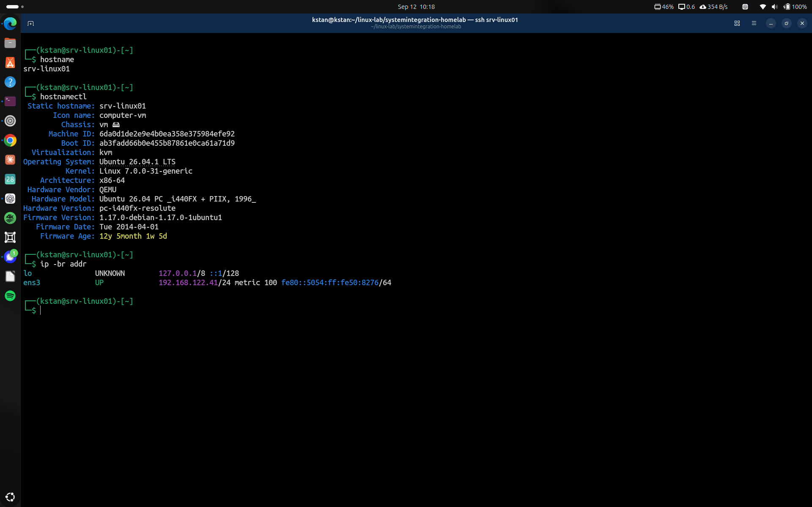

# Ubuntu Server Guest Inspection

## Objective

The objective of this stage was to inspect the Ubuntu Server guest from inside the virtual machine before making configuration changes.

The inspection focused on:

- Hostname
- Virtualization environment
- Network configuration
- Routing
- Storage layout
- Filesystem usage
- SSH service status

---

## 1. Hostname Inspection

The current hostname was checked using:

```bash
hostname
```

### Result

```text
kstan-server
```

Additional system information was inspected using:

```bash
hostnamectl
```

Important results included:

```text
Static hostname: kstan-server
Virtualization: kvm
Operating System: Ubuntu 26.04.1 LTS
Kernel: Linux 7.0.0-31-generic
Architecture: x86-64
Hardware Vendor: QEMU
```

This confirmed that the guest operating system hostname is still:

```text
kstan-server
```

while the libvirt virtual machine has already been renamed to:

```text
srv-linux01
```

The libvirt domain name and the operating system hostname are separate configuration items.

The guest hostname will be changed in a later step.

---

## 2. Network Interface Inspection

The network configuration was inspected using:

```bash
ip addr
```

The primary network interface is:

```text
ens3
```

Its MAC address is:

```text
52:54:00:50:82:76
```

Its current IPv4 address is:

```text
192.168.122.41/24
```

The address is dynamically assigned.

The interface was reported as:

```text
UP
LOWER_UP
```

which indicates that the interface is enabled and its lower network layer is operational.

---

## 3. Routing Inspection

The routing table was inspected using:

```bash
ip route
```

### Result

```text
default via 192.168.122.1 dev ens3 proto dhcp src 192.168.122.41 metric 100
192.168.122.0/24 dev ens3 proto kernel scope link src 192.168.122.41 metric 100
192.168.122.1 dev ens3 proto dhcp scope link src 192.168.122.41 metric 100
```

The default gateway is:

```text
192.168.122.1
```

The server belongs to the network:

```text
192.168.122.0/24
```

Traffic destined outside the local subnet is sent through the default gateway.

---

## 4. Block Device Inspection

The available block devices were inspected using:

```bash
lsblk
```

The main virtual disk is:

```text
vda
```

with a total virtual capacity of:

```text
50G
```

The partition structure is:

```text
vda
├─vda1    1M
├─vda2    2G   /boot
└─vda3   48G
  └─ubuntu--vg-ubuntu--lv   24G   /
```

The VM therefore uses LVM for its root filesystem.

The main 48 GiB partition is used by the LVM volume group, but the root logical volume currently has a size of only approximately:

```text
24G
```

This indicates that not all available LVM capacity is currently assigned to the root logical volume.

Further inspection of the volume group and logical volumes will be performed before making any storage changes.

---

## 5. Filesystem Usage

Filesystem usage was checked using:

```bash
df -h
```

The root filesystem is:

```text
/dev/mapper/ubuntu--vg-ubuntu--lv
```

with approximately:

```text
24G total
6.9G used
16G available
31% used
```

The `/boot` filesystem is located on:

```text
/dev/vda2
```

with approximately:

```text
2.0G total
98M used
```

This confirmed that the 50 GiB virtual disk is not fully allocated to the root filesystem.

### LVM Capacity Verification

To determine how the 48 GiB LVM partition was being used, I inspected the physical volume, volume group, and logical volume.

```bash
sudo pvs
sudo vgs
sudo lvs
```

The results showed:

| LVM Component | Size | Free |
|---|---:|---:|
| Physical volume `/dev/vda3` | ~48 GiB | 24 GiB |
| Volume group `ubuntu-vg` | ~48 GiB | 24 GiB |
| Logical volume `ubuntu-lv` | ~24 GiB | - |

The root logical volume currently uses approximately 24 GiB of the approximately 48 GiB available to the volume group.

The remaining 24 GiB is free space inside `ubuntu-vg`.

No storage changes were made during this inspection.

The free capacity can later be used to practice LVM administration, such as creating additional logical volumes or extending an existing logical volume and filesystem.

---

## 6. SSH Service Inspection

The SSH service was checked using:

```bash
systemctl status ssh --no-pager
```

The SSH service was active:

```text
Active: active (running)
```

The logs showed successful public-key authentication for the user:

```text
kstan
```

using an ED25519 SSH key.

Example log entry:

```text
Accepted publickey for kstan from 192.168.122.1
```

This confirms that remote administration using SSH public-key authentication is functioning.

---

## 7. Command Syntax Troubleshooting

During the inspection I initially entered:

```bash
systemctl status ssh -- no-pager
```

This produced:

```text
Unit no-pager.service could not be found.
```

The problem was caused by the space between:

```text
--
```

and:

```text
no-pager
```

The correct option is:

```bash
systemctl status ssh --no-pager
```

This demonstrates that incorrect command-line option syntax can cause a program to interpret an option as a separate argument or service name.

---

## 8. Current Guest State

| Component | Current State |
|---|---|
| Guest hostname | `kstan-server` |
| Guest OS | Ubuntu 26.04.1 LTS |
| Kernel | Linux 7.0.0-31-generic |
| Architecture | x86-64 |
| Virtualization | KVM |
| Virtual hardware | QEMU |
| Network interface | `ens3` |
| IPv4 address | `192.168.122.41/24` |
| Default gateway | `192.168.122.1` |
| Disk | 50 GiB |
| Root logical volume | 24 GiB |
| Root filesystem usage | 31% |
| SSH | Active |
| SSH public-key login | Working |

---

## 9. Next Steps

The next configuration tasks are:

1. Change the guest hostname from `kstan-server` to `srv-linux01`
2. Verify hostname resolution
3. Inspect LVM free space
4. Decide whether to extend the root logical volume
5. Inspect the current network configuration files
6. Prepare for static IP configuration


## 10. Server Hostname Configuration

During the initial inspection, the libvirt domain and Ubuntu guest used different names.

The libvirt domain had already been renamed to:

```text
srv-linux01
```

while the Ubuntu guest still used:

```text
kstan-server
```

The goal was to use a consistent naming convention across the virtualization and operating system layers.

### Initial State

The guest configuration was verified using:

```bash
hostname
cat /etc/hostname
cat /etc/hosts
hostnamectl
```

The system reported:

```text
Static hostname: kstan-server
```

and `/etc/hosts` contained:

```text
127.0.1.1 kstan-server
```

### Changing the Hostname

I initially attempted:

```bash
sudo systemctl set-hostname srv-linux01
```

This failed because `set-hostname` is not a `systemctl` command.

The correct utility for managing the system hostname is `hostnamectl`.

The hostname was changed using:

```bash
sudo hostnamectl set-hostname srv-linux01
```

The change was verified with:

```bash
hostname
hostnamectl
```

The system then reported:

```text
Static hostname: srv-linux01
```

### Updating Local Hostname Resolution

The `/etc/hosts` entry was updated from:

```text
127.0.1.1 kstan-server
```

to:

```text
127.0.1.1 srv-linux01
```

The final configuration was verified using:

```bash
cat /etc/hostname
cat /etc/hosts
```

The relevant configuration became:

```text
/etc/hostname:
srv-linux01

/etc/hosts:
127.0.0.1 localhost
127.0.1.1 srv-linux01
```

### Testing Name Resolution

Local hostname resolution was tested using:

```bash
getent hosts srv-linux01
```

Result:

```text
127.0.1.1       srv-linux01
```

A local connectivity test was also performed:

```bash
ping -c 2 srv-linux01
```

The test completed successfully with:

```text
2 packets transmitted, 2 received, 0% packet loss
```

This confirmed that the new hostname could be resolved locally.

### Hostname Verification

The final server identity and network configuration were verified after reconnecting through SSH.



### Verifying a New SSH Session

After changing the hostname, I disconnected from the existing SSH session and established a new connection.

The new shell prompt displayed:

```text
kstan@srv-linux01
```

This confirmed that the new hostname was active for newly created sessions.

### Updating the SSH Client Alias

The SSH client configuration on the host was also updated so that the server could be accessed using its new name.

The connection was tested with:

```bash
ssh srv-linux01
```

The connection succeeded and opened a session on:

```text
kstan@srv-linux01
```

### Final Naming State

| Layer | Name |
|---|---|
| Physical Linux host | `kstan` |
| libvirt domain | `srv-linux01` |
| Ubuntu guest hostname | `srv-linux01` |
| SSH client alias | `srv-linux01` |

The server now uses a consistent naming convention across the virtualization, guest operating system, and SSH administration layers.
