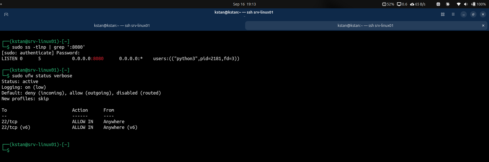
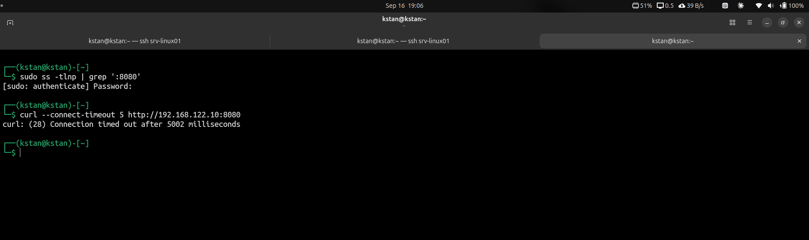

# Linux Security

## Objective

Apply basic security controls to `srv-linux01` and verify that the firewall blocks unauthorized incoming connections.

## Security Baseline

The server security configuration was inspected with:

```bash
id
sudo -l
sudo ss -tulpn
sudo ufw status verbose
apt list --upgradable
```

The checks confirmed:

- The administrative user has `sudo` access.
- SSH is listening on TCP port 22.
- UFW was initially inactive.
- No pending package upgrades were shown.

SSH had already been hardened with public-key authentication and disabled password authentication.

## UFW Firewall Configuration

SSH was allowed before enabling the firewall:

```bash
sudo ufw allow 22/tcp
```

The default firewall policies were configured:

```bash
sudo ufw default deny incoming
sudo ufw default allow outgoing
```

UFW was then enabled:

```bash
sudo ufw enable
```

The configuration was verified:

```bash
sudo ufw status verbose
```

The active policy permits SSH on TCP port 22 and denies other incoming connections by default.

A second SSH connection was opened successfully after UFW was enabled. This confirmed that remote administration remained available.

## Firewall Test

A temporary HTTP server was started on TCP port 8080:

```bash
python3 -m http.server 8080
```

The listening port was verified on `srv-linux01`:

```bash
sudo ss -tlnp | grep ':8080'
```

The output confirmed that `python3` was listening on TCP port 8080.

UFW remained active with only TCP port 22 explicitly allowed.



From the physical host, a connection to TCP port 8080 was tested:

```bash
curl --connect-timeout 5 http://192.168.122.10:8080
```

The connection timed out because TCP port 8080 was not permitted by the firewall.



The temporary HTTP server was stopped after the test.

## Key Lesson

A listening service is not automatically reachable over the network. I can use `ss` to verify the listening port and UFW to control which incoming connections are permitted. In my Linux homelab, I configured a default-deny incoming policy, explicitly allowed SSH on TCP port 22, and verified the firewall by running a temporary service on TCP 8080. The service was listening locally, but a remote connection timed out because the firewall did not permit TCP 8080.

## Security Controls Implemented

- SSH public-key authentication
- SSH password authentication disabled
- Restricted remote SSH access
- UFW firewall enabled
- Default incoming traffic denied
- Outgoing traffic allowed
- SSH explicitly allowed on TCP port 22
- Firewall logging enabled
- Listening ports inspected with `ss`
- Firewall behavior verified with a controlled TCP port test
