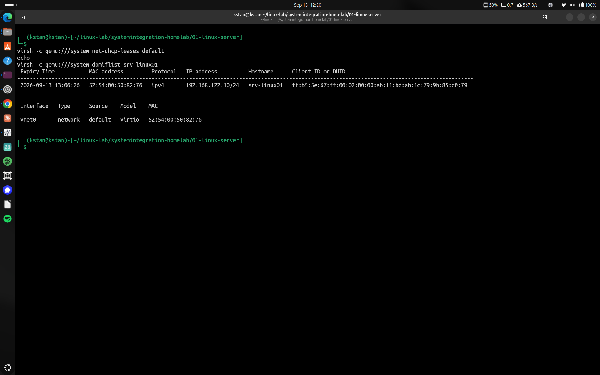

# Linux Server Network Configuration

## Objective

The objective of this stage was to inspect and understand the virtual machine's network configuration and provide the Linux server `srv-linux01` with a predictable IP address. This makes remote administration more reliable and provides a stable network configuration for services that will be deployed on the server later.

## Initial Network State

Before making any changes, I inspected the existing network configuration of `srv-linux01`.

| Property | Value |
|---|---|
| Hostname | `srv-linux01` |
| Interface | `ens3` |
| Initial IPv4 address | `192.168.122.41/24` |
| Gateway | `192.168.122.1` |
| DNS server | `192.168.122.1` |
| Address source | DHCP |
| MAC address | `52:54:00:50:82:76` |

The Netplan configuration in `/etc/netplan/00-installer-config.yaml` showed that both IPv4 and IPv6 were configured to use DHCP:

```yaml
network:
  ethernets:
    ens3:
      dhcp4: true
      dhcp6: true
      match:
        macaddress: 52:54:00:50:82:76
      set-name: ens3
  version: 2
```

## Network Architecture

The Linux server `srv-linux01` runs as a KVM/QEMU virtual machine on the physical Ubuntu host `kstan`. Libvirt manages the virtual machine and connects it to the libvirt `default` network.

The `default` network uses the private IPv4 subnet `192.168.122.0/24`. It operates in NAT mode.

The network has the following main components:

```text
                         Internet
                            |
                            v
                   Host External Network
                            |
                            v
                   Physical Ubuntu Host
                         `kstan`
                            |
                            v
                    libvirt NAT
                            |
                            v
                       `virbr0`
                   192.168.122.1/24
                            |
                            v
                        `vnet0`
                            |
                            v
                         `ens3`
                            |
                            v
                      `srv-linux01`
                   192.168.122.10/24
```

### Virtual Bridge

Libvirt creates a Linux software bridge named `virbr0` on the physical host.

The bridge has the following configuration:

```text
Interface: virbr0
IPv4:     192.168.122.1/24
Network:  192.168.122.0/24
```

`virbr0` provides Layer 2 connectivity for virtual machines on the libvirt `default` network. Its function is similar to that of a physical Ethernet switch.

The IPv4 address `192.168.122.1` is assigned to the bridge interface. `srv-linux01` uses this address as its default gateway.

### Guest and Host Network Interfaces

Inside `srv-linux01`, the virtual network interface is named `ens3`.

It has the following MAC address:

```text
52:54:00:50:82:76
```

On the physical host, libvirt creates the host-side virtual interface `vnet0`. Libvirt connects `vnet0` to the `virbr0` bridge.

The connection is:

```text
`srv-linux01`
      |
    `ens3`
      |
    vNIC
      |
    `vnet0`
      |
   `virbr0`
```

This connection lets the guest send Ethernet frames from `ens3` to the libvirt virtual network.

### Default Gateway

`srv-linux01` uses `192.168.122.1` as its default gateway:

```text
default via 192.168.122.1 dev ens3
```

A host uses its default gateway when the destination is not on a directly connected network.

`srv-linux01` is directly connected to the `192.168.122.0/24` network. It can communicate directly with other hosts on this subnet.

For traffic to a network outside `192.168.122.0/24`, the server sends the packets to `192.168.122.1`. The physical host then routes the traffic toward the required destination.

### Network Address Translation

The libvirt `default` network uses Network Address Translation (NAT).

This setting appears in the libvirt network configuration:

```xml
<forward mode='nat'>
```

NAT lets `srv-linux01` use its private IPv4 address and still access external networks.

Outbound traffic follows this path:

```text
`srv-linux01`
192.168.122.10
      |
      v
    `ens3`
      |
      v
    `vnet0`
      |
      v
   `virbr0`
192.168.122.1
      |
      v
 libvirt NAT
      |
      v
Host External Network
      |
      v
   Internet
```

When `srv-linux01` starts an outbound connection, the host translates the source address as it forwards the traffic to the external network.

When response traffic returns, the host translates the connection information and sends the traffic back to `srv-linux01`.

This configuration gives the VM access to external networks. The private address `192.168.122.10` does not have to be directly routable on the physical network.

The NAT configuration does not normally permit an external system to start a connection directly to `192.168.122.10`. A different network configuration or additional forwarding rules would be necessary for this type of inbound connection.

### DHCP and DNS

The libvirt network provides DHCP services to `srv-linux01`.

Before I configured the DHCP reservation, the server received the following network information:

```text
IPv4 address: 192.168.122.41/24
Gateway:      192.168.122.1
DNS server:   192.168.122.1
```

Netplan configures `srv-linux01` as a DHCP client. Therefore, the guest does not contain a manually configured static IPv4 address.

I later configured a DHCP reservation on the libvirt network.

The reservation maps the MAC address of `ens3` to the IPv4 address `192.168.122.10`:

```text
52:54:00:50:82:76
        |
        | DHCP request
        v
 libvirt DHCP service
        |
        | DHCP reservation
        v
  192.168.122.10/24
        |
        v
   `srv-linux01`
```

The guest remains a DHCP client, but the DHCP server now assigns `192.168.122.10` to the same MAC address.

This configuration gives `srv-linux01` a predictable IPv4 address without requiring a static IPv4 configuration inside the guest operating system.


## Inspecting the Guest Network Configuration

I inspected the network configuration from inside `srv-linux01`. This inspection identified the active network interface, IPv4 address, MAC address, routing configuration, DNS server, and DHCP configuration.

### Network Interface

I used the following command to show a concise list of the network interfaces:

```bash
ip -br addr
```

The relevant output was:

```text
ens3    UP    192.168.122.10/24
```

The result shows that `ens3` is active and has the IPv4 address `192.168.122.10/24`.

I then inspected the interface in more detail:

```bash
ip link show ens3
```

The command showed the following important information:

```text
Interface:   ens3
State:       UP
MAC address: 52:54:00:50:82:76
MTU:         1500
```

The MAC address identifies the virtual network interface. The DHCP reservation for `srv-linux01` uses this MAC address.

### Routing Table

I inspected the routing table with:

```bash
ip route
```

The routing table contained:

```text
default via 192.168.122.1 dev ens3 proto dhcp src 192.168.122.10 metric 100
192.168.122.0/24 dev ens3 proto kernel scope link src 192.168.122.10 metric 100
192.168.122.1 dev ens3 proto dhcp scope link src 192.168.122.10 metric 100
```

The default route uses `192.168.122.1` as the gateway and `ens3` as the network interface.

The `192.168.122.0/24` route identifies the local virtual network. Linux can send traffic directly through `ens3` when the destination is on this subnet.

For destinations that do not match a more specific route, Linux sends the traffic to the default gateway at `192.168.122.1`.

### DNS Configuration

I inspected the DNS configuration for `ens3` with:

```bash
resolvectl status ens3
```

The relevant output was:

```text
Current DNS Server: 192.168.122.1
DNS Servers: 192.168.122.1
Default Route: yes
```

The result shows that `srv-linux01` uses `192.168.122.1` as its DNS server.

### Network Management

I used `networkctl` to inspect how `systemd-networkd` manages `ens3`:

```bash
networkctl status ens3
```

The important results were:

```text
State:            routable (configured)
Driver:           virtio_net
Hardware Address: 52:54:00:50:82:76
Address:          192.168.122.10 (DHCPv4 via 192.168.122.1)
Gateway:          192.168.122.1
DNS:              192.168.122.1
```

The `virtio_net` driver confirms that `ens3` is a virtual Virtio network device.

The output also confirms that DHCP supplied the IPv4 address `192.168.122.10` through `192.168.122.1`.

### Netplan Configuration

I inspected the Netplan configuration with:

```bash
sudo cat /etc/netplan/00-installer-config.yaml
```

The Netplan configuration in `/etc/netplan/00-installer-config.yaml` showed that both IPv4 and IPv6 were configured to use DHCP:

```yaml
network:
  ethernets:
    ens3:
      dhcp4: true
      dhcp6: true
      match:
        macaddress: 52:54:00:50:82:76
      set-name: ens3
  version: 2
```

## Network Architecture

The setting `dhcp4: true` configures `ens3` to obtain its IPv4 configuration through DHCP.

The `match` section identifies the interface by its MAC address. The `set-name` setting assigns the interface name `ens3`.

The guest operating system does not contain a manually configured static IPv4 address. It remains a DHCP client. The libvirt DHCP server assigns the predictable address `192.168.122.10` because of the DHCP reservation that is configured on the host.

### Guest Network Summary

The inspection confirmed the following guest network configuration:

| Property | Value |
|---|---|
| Interface | `ens3` |
| Interface state | `UP` |
| IPv4 address | `192.168.122.10/24` |
| MAC address | `52:54:00:50:82:76` |
| Network driver | `virtio_net` |
| Default gateway | `192.168.122.1` |
| DNS server | `192.168.122.1` |
| IPv4 configuration | DHCP |
| Network manager | `systemd-networkd` through Netplan |

These checks confirm that `ens3` is operational. The guest receives its IPv4 address, default gateway, and DNS configuration through DHCP from the libvirt network.

## Inspecting the libvirt Network

I inspected the libvirt network from the physical host `kstan`. This inspection confirmed how `srv-linux01` connects to the virtual network and how libvirt provides DHCP and NAT services.

### Virtual Machine State

I first confirmed that the virtual machine was running:

```bash
virsh -c qemu:///system list --all
```

The relevant result was:

```text
Id   Name          State
-----------------------------
1    srv-linux01   running
```

This confirmed that `srv-linux01` was active on the physical host.

### Libvirt Network State

I inspected the available libvirt networks with:

```bash
virsh -c qemu:///system net-list --all
```

The relevant result was:

```text
Name      State    Autostart   Persistent
--------------------------------------------
default   active   yes         yes
```

The `default` network was active.

The `Autostart` value was `yes`. This means libvirt is configured to start the network automatically.

The `Persistent` value was also `yes`. This means the network configuration is stored and remains available after a system restart.

I then inspected the network details:

```bash
virsh -c qemu:///system net-info default
```

The result showed:

```text
Name:       default
Active:     yes
Persistent: yes
Autostart:  yes
Bridge:     virbr0
```

This confirmed that the `default` network uses the `virbr0` bridge.

### Libvirt Network Definition

I inspected the complete network definition with:

```bash
virsh -c qemu:///system net-dumpxml default
```

The important part of the configuration was:

```xml
<forward mode='nat'>
  <nat>
    <port start='1024' end='65535'/>
  </nat>
</forward>

<bridge name='virbr0' stp='on' delay='0'/>

<ip address='192.168.122.1' netmask='255.255.255.0'>
  <dhcp>
    <range start='192.168.122.2' end='192.168.122.254'/>
    <host mac='52:54:00:50:82:76'
          name='srv-linux01'
          ip='192.168.122.10'/>
  </dhcp>
</ip>
```

This configuration confirmed the following network settings:

| Property | Value |
|---|---|
| Network mode | NAT |
| Bridge | `virbr0` |
| Gateway | `192.168.122.1` |
| Subnet | `192.168.122.0/24` |
| DHCP range | `192.168.122.2` to `192.168.122.254` |
| Reserved MAC address | `52:54:00:50:82:76` |
| Reserved IPv4 address | `192.168.122.10` |
| Reserved hostname | `srv-linux01` |

### DHCP Lease

I inspected the active DHCP leases with:

```bash
virsh -c qemu:///system net-dhcp-leases default
```

The relevant lease was:

```text
MAC address: 52:54:00:50:82:76
Protocol:    ipv4
IP address:  192.168.122.10/24
Hostname:    srv-linux01
```

This confirmed that the DHCP reservation was active and that `srv-linux01` had received the reserved IPv4 address.

### Virtual Machine Network Interface

I inspected the network interface that libvirt assigned to the virtual machine:

```bash
virsh -c qemu:///system domiflist srv-linux01
```

The result was:

```text
Interface   Type      Source    Model    MAC
-------------------------------------------------------------
vnet0       network   default   virtio   52:54:00:50:82:76
```

The output confirmed that:

- `vnet0` is the host-side virtual interface.
- The interface connects to the libvirt `default` network.
- The virtual NIC uses the `virtio` model.
- The MAC address matches the MAC address of `ens3` inside `srv-linux01`.

The matching MAC address confirms the relationship between the guest interface and the host-side libvirt interface.

```text
srv-linux01
     |
   ens3
     |
52:54:00:50:82:76
     |
   vnet0
     |
default network
     |
  virbr0
```

### Verification Screenshot

The following screenshot shows the active DHCP lease and the virtual machine network interface:



The screenshot confirms that the same MAC address appears in both the DHCP lease and the virtual machine interface configuration.

This provides evidence that `srv-linux01` is connected to the libvirt `default` network and receives the reserved IPv4 address `192.168.122.10`.


## DHCP Addressing


`srv-linux01` uses DHCP for its IPv4 configuration.

The Netplan configuration contains:

```yaml
dhcp4: true
```

This setting means that the guest requests its IPv4 configuration from a DHCP server.

The libvirt `default` network provides the DHCP service.

The configured DHCP range is:

```text
192.168.122.2 - 192.168.122.254
```

Before I configured a DHCP reservation, `srv-linux01` received the IPv4 address:

```text
192.168.122.41/24
```

This address was assigned dynamically.

### DHCP Lease

I inspected the active DHCP lease with:

```bash
virsh -c qemu:///system net-dhcp-leases default
```

The relevant lease was:

```text
MAC address: 52:54:00:50:82:76
Protocol:    ipv4
IP address:  192.168.122.10/24
Hostname:    srv-linux01
```

A DHCP lease is a temporary assignment of network configuration to a DHCP client.

The lease confirms that `srv-linux01` currently uses the IPv4 address `192.168.122.10/24`.

### DHCP Reservation

I inspected the DHCP configuration with:

```bash
virsh -c qemu:///system net-dumpxml default | grep -A 4 '<dhcp>'
```

The relevant configuration was:

```xml
<dhcp>
  <range start='192.168.122.2' end='192.168.122.254'/>
  <host mac='52:54:00:50:82:76'
        name='srv-linux01'
        ip='192.168.122.10'/>
</dhcp>
```

The `host` entry creates a DHCP reservation.

The reservation maps the MAC address of `srv-linux01` to the IPv4 address `192.168.122.10`.

```text
52:54:00:50:82:76
        |
        v
DHCP reservation
        |
        v
192.168.122.10
```

The guest remains configured as a DHCP client. However, the DHCP server assigns the same reserved IPv4 address to the VM when the MAC address matches the reservation.

The address `192.168.122.10` is inside the configured DHCP range. The predictable address is provided by the explicit reservation, not by a static configuration inside the guest.


## Choosing a Predictable Server Address

The initial IPv4 address of `srv-linux01` was:

```text
192.168.122.41/24
```

The DHCP server assigned this address dynamically. A dynamically assigned address can change when the DHCP lease changes.

This behavior is acceptable for many client systems. However, a server benefits from a predictable IPv4 address.

I plan to use `srv-linux01` for services and administration tasks. These tasks can include SSH access, file sharing, DNS, web services, and other server applications.

A predictable address makes it easier to connect to the server and configure services that depend on its network location.

### Selected Address

I selected the following IPv4 address for `srv-linux01`:

```text
192.168.122.10/24
```

The address belongs to the same `192.168.122.0/24` subnet as the original address.

The network configuration remains:

```text
Server address: 192.168.122.10/24
Network:        192.168.122.0/24
Gateway:        192.168.122.1
DNS server:     192.168.122.1
```

Before I used `192.168.122.10`, I checked whether the address showed evidence of current use.

I tested the address from the physical host with:

```bash
ping -c 3 192.168.122.10
```

The test did not receive a response.

I also inspected the neighbor table:

```bash
ip neigh show 192.168.122.10
```

The result showed:

```text
192.168.122.10 dev virbr0 FAILED
```

I then inspected the active DHCP leases:

```bash
virsh -c qemu:///system net-dhcp-leases default
```

At that time, the active lease for `srv-linux01` used `192.168.122.41`. No active lease showed `192.168.122.10`.

These checks did not show evidence that another active system was using `192.168.122.10`.

### DHCP Reservation Instead of a Static Guest Address

I considered two methods to give the server a predictable IPv4 address:

1. Configure a static IPv4 address in Netplan inside `srv-linux01`.
2. Keep the guest as a DHCP client and create a DHCP reservation in libvirt.

I selected the DHCP reservation method.

This method keeps the guest network configuration simple:

```yaml
dhcp4: true
```

Libvirt manages the address assignment from the physical host. The DHCP reservation maps the VM's MAC address to the selected IPv4 address:

```text
52:54:00:50:82:76 -> 192.168.122.10
```

The guest can continue to receive its gateway and DNS configuration through DHCP.

This design also keeps the address assignment in the same libvirt configuration that manages the virtual network.

The result is a predictable server address without a manually configured static IPv4 address inside `srv-linux01`.


## Creating the DHCP Reservation

Before I changed the libvirt network configuration, I created a backup of the existing network definition.

### Backing Up the Network Configuration

I used:

```bash
virsh -c qemu:///system net-dumpxml default > ~/linux-lab/default-network-before-dhcp-reservation.xml
```

This command exported the existing `default` network definition to:

```text
~/linux-lab/default-network-before-dhcp-reservation.xml
```

The backup provided a copy of the network configuration before I added the DHCP reservation.

### Adding the Reservation

I added the DHCP reservation from the physical host `kstan`.

I used:

```bash
sudo virsh -c qemu:///system net-update default add ip-dhcp-host \
"<host mac='52:54:00:50:82:76' name='srv-linux01' ip='192.168.122.10'/>" \
--live --config
```

The command returned:

```text
Updated network default persistent config and live state
```

The reservation contains three important values:

| Property | Value |
|---|---|
| MAC address | `52:54:00:50:82:76` |
| Hostname | `srv-linux01` |
| Reserved IPv4 address | `192.168.122.10` |

The MAC address identifies the network interface of `srv-linux01`. Libvirt uses this value to determine which DHCP client must receive the reserved address.

### Live and Persistent Configuration

The command used the following two options:

```text
--live
--config
```

`--live` applied the change to the active libvirt network.

`--config` applied the change to the persistent network configuration.

Using both options made the reservation active and stored the configuration for later network starts.

### Verifying the Network Definition

I inspected the network definition after I added the reservation:

```bash
virsh -c qemu:///system net-dumpxml default
```

The DHCP section now contained:

```xml
<dhcp>
  <range start='192.168.122.2' end='192.168.122.254'/>
  <host mac='52:54:00:50:82:76'
        name='srv-linux01'
        ip='192.168.122.10'/>
</dhcp>
```

This confirmed that libvirt had added the DHCP reservation to the `default` network.

The guest configuration did not require a static IPv4 address. `srv-linux01` remained configured with:

```yaml
dhcp4: true
```

The address assignment was now controlled by the DHCP reservation on the physical host.


## Verifying the New Address

After I added the DHCP reservation, `srv-linux01` still used its existing DHCP address:

```text
192.168.122.41/24
```

The reservation was active on the DHCP server, but the guest had not yet obtained the new address.

### Restarting the Virtual Machine

I restarted `srv-linux01` from the physical host:

```bash
virsh -c qemu:///system reboot srv-linux01
```

I then checked the state of the virtual machine with:

```bash
virsh -c qemu:///system domstate srv-linux01
```

The result was:

```text
running
```

This confirmed that the virtual machine was running after the restart.

### Verifying the DHCP Lease

I inspected the DHCP leases again:

```bash
virsh -c qemu:///system net-dhcp-leases default
```

The lease now showed:

```text
MAC address: 52:54:00:50:82:76
Protocol:    ipv4
IP address:  192.168.122.10/24
Hostname:    srv-linux01
```

The MAC address matched the DHCP reservation.

The IPv4 address had changed from:

```text
192.168.122.41
```

to:

```text
192.168.122.10
```

This confirmed that the DHCP server assigned the reserved address to `srv-linux01`.

### Testing the New Address from the Host

I tested the new address from the physical host:

```bash
ping -c 4 192.168.122.10
```

The test completed without packet loss.

I then connected to the server with SSH:

```bash
ssh kstan@192.168.122.10
```

The SSH connection was successful.

Inside the guest, I confirmed the hostname:

```bash
hostname
```

The result was:

```text
srv-linux01
```

I also inspected the IPv4 address of `ens3`:

```bash
ip -br addr show ens3
```

The result showed:

```text
ens3    UP    192.168.122.10/24
```

These checks confirmed that the DHCP reservation was active and that `srv-linux01` was using the new predictable IPv4 address.


## Testing Network Connectivity

After I configured the DHCP reservation, I tested the network connection from inside `srv-linux01`.

The tests checked the default gateway, Internet access, DNS resolution, and HTTPS connectivity.

### Testing the Default Gateway

I first tested the connection between `srv-linux01` and its default gateway:

```bash
ping -c 3 192.168.122.1
```

The test completed without packet loss.

This confirmed that `srv-linux01` could communicate with the libvirt gateway at `192.168.122.1`.

The communication path was:

```text
srv-linux01
192.168.122.10
      |
      v
    ens3
      |
      v
192.168.122.1
Default Gateway
```

### Testing Internet Connectivity

I then tested connectivity to an external IPv4 address:

```bash
ping -c 4 1.1.1.1
```

The test completed without packet loss.

This test used an IP address instead of a hostname. Therefore, it tested external IP connectivity without depending on DNS name resolution.

The successful result confirmed that traffic from `srv-linux01` could pass through the libvirt NAT network and reach an external network.

### Testing DNS Resolution

I tested DNS name resolution with:

```bash
getent hosts ubuntu.com
```

The command returned IP addresses for `ubuntu.com`.

This confirmed that the server could resolve a hostname through its configured DNS service.

The DNS path was:

```text
srv-linux01
      |
      | DNS query
      v
192.168.122.1
      |
      v
DNS resolution
      |
      v
IP address for ubuntu.com
```

### Testing HTTPS Connectivity

I performed an application-level connectivity test with:

```bash
curl -I https://ubuntu.com
```

The command returned:

```text
HTTP/2 200
```

The HTTP status code `200` indicates that the HTTPS request completed successfully.

This test confirmed more than basic IP connectivity. It showed that the server could resolve the hostname, establish an external connection, negotiate HTTPS, and receive an HTTP response.

### Connectivity Test Summary

The tests verified the network at different levels:

| Test | Command | Result |
|---|---|---|
| Default gateway | `ping -c 3 192.168.122.1` | Successful |
| External IPv4 connectivity | `ping -c 4 1.1.1.1` | Successful |
| DNS resolution | `getent hosts ubuntu.com` | Successful |
| HTTPS connectivity | `curl -I https://ubuntu.com` | `HTTP/2 200` |


### Verification Screenshot

The following screenshot shows the gateway, Internet connectivity, and DNS resolution tests from `srv-linux01`.


All tests completed successfully.

The results confirmed that `srv-linux01` had a working network path from the guest interface through the libvirt network to external networks.

```text
srv-linux01
      |
      v
    ens3
      |
      v
   vnet0
      |
      v
   virbr0
      |
      v
libvirt NAT
      |
      v
External Network
```

## Updating the SSH Client Configuration

After the server address changed from `192.168.122.41` to `192.168.122.10`, I updated the SSH client configuration on the physical host.

The SSH client configuration is stored in:

```text
~/.ssh/config
```

The configuration for `srv-linux01` is:

```text
Host srv-linux01
HostName 192.168.122.10
Port 22
User kstan
```

The `Host` entry defines the SSH alias.

The `HostName` entry defines the IPv4 address of the remote server.

The `Port` entry specifies the SSH service port.

The `User` entry defines the remote login account.

### Verifying the SSH Configuration

I inspected the effective OpenSSH configuration with:

```bash
ssh -G srv-linux01 | grep -E '^(hostname|user|port) '
```

The command returned:

```text
user kstan
hostname 192.168.122.10
port 22
```

This confirmed that the SSH alias resolves to the expected user, address, and port.

### Testing the SSH Alias

I connected to the server with:

```bash
ssh srv-linux01
```

The connection was successful.

After I connected, I verified the hostname:

```bash
hostname
```

The result was:

```text
srv-linux01
```

I also verified the network address of `ens3`:

```bash
ip -br addr show ens3
```

The relevant result was:

```text
ens3    UP    192.168.122.10/24
```

I then closed the SSH session with:

```bash
exit
```

These checks confirmed that the SSH alias connects to the correct server at the reserved IPv4 address.

Using the alias allows me to connect with:

```bash
ssh srv-linux01
```

instead of:

```bash
ssh kstan@192.168.122.10
```

## Troubleshooting

During the network configuration, I encountered several problems. I used the command output and system architecture to identify each cause.

### Problem 1: Running libvirt Commands Inside the Guest

I initially tried to inspect the libvirt network from inside `srv-linux01`.

After I installed the `libvirt-clients` package, I tried a command such as:

```bash
virsh -c qemu:///system net-list --all
```

The command could not connect to the libvirt system socket.

The important distinction was that `srv-linux01` is a guest virtual machine. The libvirt hypervisor and its `default` network are managed by the physical host `kstan`.

The management relationship is:

```text
Physical host: kstan
      |
      | libvirt management
      v
KVM/QEMU
      |
      v
Guest VM: srv-linux01
```

Therefore, commands that manage the local hypervisor must run on `kstan`:

```bash
virsh -c qemu:///system net-list --all
```

Commands that inspect the guest operating system must run inside `srv-linux01`. Examples include:

```bash
ip addr
ip route
networkctl status ens3
systemctl status ssh
```

This problem showed the importance of identifying which system owns a resource before troubleshooting it.

### Problem 2: Using an Incorrect virsh Command

After restarting the virtual machine, I tried:

```bash
virsh -c qemu:///system status srv-linux01
```

`virsh` reported that `status` was an unknown command.

I checked the appropriate domain command and used:

```bash
virsh -c qemu:///system domstate srv-linux01
```

The command returned:

```text
running
```

The correct command is `domstate` because `srv-linux01` is a libvirt domain.

This problem showed that command names should be verified instead of assumed.

### Problem 3: The Old DHCP Address Remained After the Reservation

After I created the DHCP reservation, I expected the guest address to change immediately from:

```text
192.168.122.41
```

to:

```text
192.168.122.10
```

The guest initially continued to use `192.168.122.41`.

The DHCP reservation had changed the DHCP server configuration, but the guest still had its existing DHCP configuration.

I restarted the virtual machine:

```bash
virsh -c qemu:///system reboot srv-linux01
```

After the restart, I inspected the DHCP lease:

```bash
virsh -c qemu:///system net-dhcp-leases default
```

The lease now showed:

```text
192.168.122.10/24
```

I also verified the address inside the guest:

```bash
ip -br addr show ens3
```

The result showed:

```text
ens3    UP    192.168.122.10/24
```

This problem demonstrated that changing a DHCP reservation does not necessarily replace the network configuration already held by a running client.

### Troubleshooting Lessons

The main troubleshooting lessons from this stage were:

- Identify whether a command belongs on the physical host or inside the guest.
- Read command errors before changing the system.
- Verify the correct command syntax instead of guessing.
- Check both the DHCP server and DHCP client when troubleshooting address assignment.
- Test each network layer separately.
- Confirm a configuration change with command output instead of assuming it succeeded.


## Final Network Configuration

After completing the configuration and verification, `srv-linux01` had the following network configuration:

| Property | Final Configuration |
|---|---|
| Hostname | `srv-linux01` |
| Guest interface | `ens3` |
| Interface state | `UP` |
| MAC address | `52:54:00:50:82:76` |
| IPv4 address | `192.168.122.10/24` |
| Address method | DHCP with reservation |
| Default gateway | `192.168.122.1` |
| DNS server | `192.168.122.1` |
| Libvirt network | `default` |
| Network mode | NAT |
| Virtual bridge | `virbr0` |
| Network | `192.168.122.0/24` |
| DHCP range | `192.168.122.2 - 192.168.122.254` |
| SSH port | `22` |
| SSH alias | `srv-linux01` |

The final address assignment is:

```text
MAC address
52:54:00:50:82:76
        |
        v
libvirt DHCP reservation
        |
        v
192.168.122.10/24
```

The guest remains a DHCP client:

```yaml
dhcp4: true
```

Libvirt provides the predictable IPv4 address through the DHCP reservation.

The final network path is:

```text
srv-linux01
192.168.122.10/24
        |
      ens3
        |
      vnet0
        |
      virbr0
192.168.122.1/24
        |
   libvirt NAT
        |
        v
External Network
```

The following tests confirmed the final configuration:

- The guest could reach the default gateway.
- The guest could reach an external IPv4 address.
- DNS name resolution worked.
- HTTPS connectivity worked.
- The physical host could reach the guest.
- SSH access worked through the `srv-linux01` alias.

The server now has a predictable network address that can support later homelab services and administration tasks.

## What I Learned

This network configuration helped me understand how DHCP, routing, NAT, virtual bridges, and network interfaces work together.

I learned that DHCP can automatically provide network configuration to a client. This can include an IPv4 address, subnet information, default gateway, and DNS server addresses.

In this lab, `srv-linux01` remains a DHCP client. Libvirt uses a DHCP reservation to assign `192.168.122.10` to the MAC address `52:54:00:50:82:76`.

I learned the difference between a DHCP reservation and a static address configured inside a guest. A DHCP reservation is controlled by the DHCP server. A static guest address is configured inside the guest operating system.

I also learned the purpose of a default gateway. `srv-linux01` can communicate with systems on its directly connected `192.168.122.0/24` network. Traffic for destinations outside this network is sent to the default gateway at `192.168.122.1`.

I learned that NAT allows `srv-linux01` to use its private IPv4 address while communicating with external networks.

I also learned how the virtual interfaces are connected:

```text
srv-linux01
     |
   ens3
     |
   vnet0
     |
  virbr0
     |
libvirt NAT
     |
External Network
```

`ens3` is the network interface inside the guest. `vnet0` is its corresponding host-side virtual interface. `virbr0` provides the virtual bridge for the libvirt network.

One of the most important troubleshooting lessons was understanding the difference between the physical host and the guest. Libvirt manages the virtual machine and virtual network on `kstan`. Therefore, hypervisor management commands such as `virsh` must run on the physical host.

Commands such as `ip`, `networkctl`, and `systemctl` can then inspect networking and services inside `srv-linux01`.

I also learned not to assume that a configuration change worked. I verified each stage by checking the DHCP lease, IP address, routing table, DNS configuration, gateway connectivity, Internet connectivity, and SSH access.
