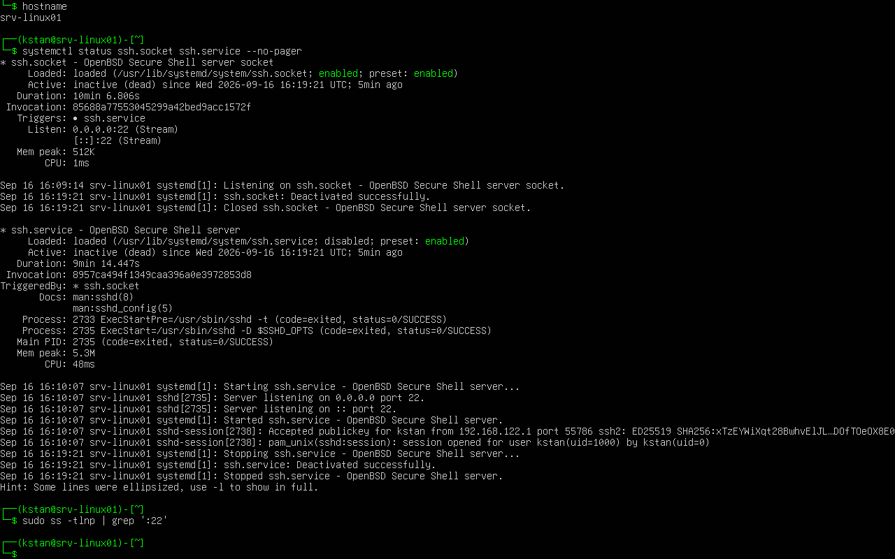
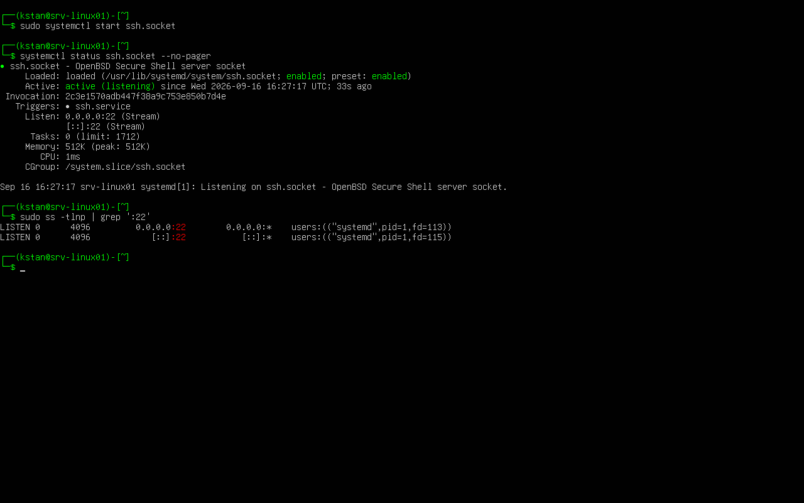

# Linux Network Troubleshooting

## Objective

Diagnose and resolve an SSH connectivity failure on the Ubuntu server `srv-linux01`.

The exercise demonstrates how to distinguish between a network connectivity problem and a service availability problem.

## Environment

- Server: `srv-linux01`
- Operating system: Ubuntu Server 26.04.1 LTS
- IPv4 address: `192.168.122.10/24`
- Gateway: `192.168.122.1`
- Network interface: `ens3`
- Virtualization: KVM/QEMU with libvirt
- SSH port: TCP 22

## Troubleshooting Method

The following sequence was used:

```text
Interface -> IP address -> Route -> Gateway -> DNS -> Service/Port
```

This sequence helps isolate the fault before changing the system configuration.

## 1. Verify the Network Interface

The interface and IP address were checked with:

```bash
ip -brief address show ens3
```

Result:

```text
ens3 UP 192.168.122.10/24
```

The interface was active and had the expected IPv4 address.

## 2. Verify Routing

The routing table was checked with:

```bash
ip route
```

The server had the expected default gateway:

```text
default via 192.168.122.1 dev ens3
```

## 3. Test Network Connectivity

The gateway was tested with:

```bash
ping -c 3 192.168.122.1
```

The test completed with 0% packet loss.

External connectivity was also tested:

```bash
ping -c 3 1.1.1.1
```

This confirmed that the server could reach an external IP address.

DNS resolution was also verified successfully.

## 4. Create an SSH Failure

For the troubleshooting exercise, the SSH socket and service were intentionally stopped from the Virtual Machine Manager console:

```bash
sudo systemctl stop ssh.socket
sudo systemctl stop ssh.service
```

The server remained reachable from the physical host:

```bash
ping -c 3 192.168.122.10
```

However, an SSH connection failed:

```bash
ssh srv-linux01
```

Result:

```text
ssh: connect to host 192.168.122.10 port 22: Connection refused
```

This showed that the network connection was working, but the SSH service was unavailable.

## 5. Diagnose the SSH Failure

The SSH units were inspected from the VM console:

```bash
systemctl status ssh.socket ssh.service --no-pager
```

Both units were inactive.

Port 22 was also checked:

```bash
sudo ss -tlnp | grep ':22'
```

No output was returned because nothing was listening on TCP port 22.

### Evidence - SSH Service Failure

The Virtual Machine Manager console shows the inactive SSH socket and service. It also shows that no process was listening on port 22.



## 6. Restore SSH Access

The SSH socket was started again:

```bash
sudo systemctl start ssh.socket
```

Its status was verified:

```bash
systemctl status ssh.socket --no-pager
```

The socket reported:

```text
active (listening)
```

Port 22 was checked again:

```bash
sudo ss -tlnp | grep ':22'
```

The server was listening on TCP port 22 again.

### Evidence - SSH Service Restored

The Virtual Machine Manager console shows the restored SSH socket and the active port 22 listeners.



## 7. Verify the Fix

A new SSH connection was tested from the physical host:

```bash
ssh srv-linux01
```

The connection succeeded.

The troubleshooting sequence was therefore:

```text
SSH connection refused
        |
        v
Server responds to ping
        |
        v
Network connectivity works
        |
        v
Check TCP port 22
        |
        v
No SSH listener
        |
        v
Check SSH service/socket
        |
        v
SSH socket inactive
        |
        v
Start ssh.socket
        |
        v
Port 22 listening
        |
        v
SSH connection successful
```

## Key Lessons

- A successful ping does not prove that an application service is available.
- `ip` can verify interfaces, addresses, and routes.
- `ping` can test basic network reachability.
- `ss` can identify listening TCP ports.
- `systemctl` can verify the state of a network service.
- `Connection refused` can indicate that the destination is reachable but the required service is not accepting connections.
- Troubleshooting should isolate the fault before configuration changes are made.
