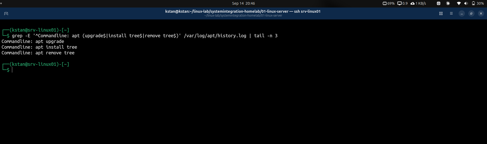

# Package Management with APT

## Objective

This lab covers package management on an Ubuntu Server.

The objectives are to:

- Update the local package index.
- Identify available package upgrades.
- Preview upgrades before installation.
- Upgrade installed packages.
- Search for packages.
- Inspect package information.
- Install and verify a package.
- Identify which package owns a file.
- Remove a package.
- Check for unused dependencies.
- Review the APT package history.

---

## 1. Update the Package Index

APT uses local package metadata to determine which packages and versions are available from configured repositories.

Update the local package index:

```bash
sudo apt update
```

The command downloads current package information from the configured Ubuntu repositories.

After the update, APT reported that eight packages could be upgraded.

Check available upgrades:

```bash
apt list --upgradable
```

The server reported these packages:

```text
dmidecode
libaudit-common
libaudit1
libflashrom1
mdadm
python-apt-common
python3-apt
sos
```

`apt update` does not upgrade installed software. It only refreshes package metadata.

---

## 2. Preview Package Upgrades

Before changing the system, preview the proposed upgrade:

```bash
sudo apt upgrade --dry-run
```

The simulation reported:

```text
Upgrading: 8
Installing: 0
Removing: 0
Not Upgrading: 0
```

The dry run confirmed that APT would upgrade eight packages without installing or removing additional packages.

Using `--dry-run` is useful when checking proposed package changes before applying them.

---

## 3. Upgrade Installed Packages

Install the available upgrades:

```bash
sudo apt upgrade
```

APT displayed a summary before making changes:

```text
Upgrading: 8
Installing: 0
Removing: 0
Not Upgrading: 0
```

After confirmation, APT downloaded and installed the newer package versions.

During the upgrade, some services were restarted automatically.

APT also reported that the running kernel was current:

```text
Running kernel seems to be up-to-date.
```

---

## 4. Verify the Upgrade

Check again for available upgrades:

```bash
apt list --upgradable
```

The command returned no packages.

This confirmed that all available upgrades had been installed.

A specific package can also be inspected with:

```bash
apt policy dmidecode
```

The result showed:

```text
Installed: 3.6-2ubuntu1
Candidate: 3.6-2ubuntu1
```

The installed and candidate versions were identical.

This confirmed that `dmidecode` was running the current version available from the configured repositories.

---

## 5. Search for Packages

APT can search the configured repositories for packages.

Search for packages containing the word `tree`:

```bash
apt search tree
```

This produced many results because APT searched package names and descriptions.

Use a regular expression to search for the exact package name:

```bash
apt search '^tree$'
```

The result was:

```text
tree/resolute 2.3.1-1 amd64
displays an indented directory tree, in color
```

The exact search is useful when the package name is already known.

---

## 6. Inspect Package Information

Inspect the package before installation:

```bash
apt show tree
```

Important information included:

```text
Package: tree
Version: 2.3.1-1
Priority: optional
Section: universe/utils
Installed-Size: 125 kB
Depends: libc6
```

`apt show` can display information such as:

- Package name
- Version
- Repository section
- Dependencies
- Download size
- Installed size
- Description

This information can help evaluate a package before installation.

---

## 7. Install a Package

Install `tree`:

```bash
sudo apt install tree
```

APT reported:

```text
Upgrading: 0
Installing: 1
Removing: 0
Not Upgrading: 0
```

The installed version was:

```text
tree 2.3.1-1
```

---

## 8. Verify the Installed Package

Use `dpkg` to verify the package:

```bash
dpkg -l tree
```

The result included:

```text
ii  tree  2.3.1-1  amd64
```

The `ii` status indicates that the package is installed and configured.

Locate the executable:

```bash
command -v tree
```

The result was:

```text
/usr/bin/tree
```

Check the installed version:

```bash
tree --version
```

The server reported:

```text
tree v2.3.1
```

These commands confirmed that the package was installed and its executable was available.

---

## 9. Identify the Package That Owns a File

Use `dpkg -S` to determine which installed package owns a file:

```bash
dpkg -S "$(command -v tree)"
```

The result was:

```text
tree: /usr/bin/tree
```

This confirmed that `/usr/bin/tree` belongs to the `tree` package.

This command is useful during troubleshooting when a file exists but its package is unknown.

For example:

```bash
dpkg -S /usr/bin/tree
```

---

## 10. Remove a Package

Remove `tree`:

```bash
sudo apt remove tree
```

APT reported:

```text
Upgrading: 0
Installing: 0
Removing: 1
Not Upgrading: 0
```

APT removed the package and freed the disk space used by it.

---

## 11. Verify Package Removal

Check the package database:

```bash
dpkg -l tree
```

The result was:

```text
dpkg-query: no packages found matching tree
```

Check whether the executable still exists:

```bash
command -v tree
```

The command returned no path.

These results confirmed that `tree` was removed successfully.

---

## 12. Understand `remove` and `purge`

APT provides two common methods for uninstalling packages.

Remove a package:

```bash
sudo apt remove <package>
```

This removes the package but can leave package-managed configuration files.

Purge a package:

```bash
sudo apt purge <package>
```

This removes the package and its package-managed configuration files.

For example:

```bash
sudo apt purge tree
```

The `tree` package did not leave configuration files during this exercise. Therefore, no additional purge operation was required.

---

## 13. Check for Unused Dependencies

Packages installed as dependencies can become unnecessary after other packages are removed.

Preview automatic removal:

```bash
sudo apt autoremove --dry-run
```

The result was:

```text
Upgrading: 0
Installing: 0
Removing: 0
Not Upgrading: 0
```

No unused automatically installed dependencies were found.

The `--dry-run` option is useful because it shows what APT intends to remove before the system is changed.

If the proposed changes are correct, unused dependencies can be removed with:

```bash
sudo apt autoremove
```

---

## 14. Review APT Package History

APT records package operations in:

```text
/var/log/apt/history.log
```

Inspect recent package-management activity:

```bash
grep -E 'Commandline:|Upgrade:|Install:|Remove:' /var/log/apt/history.log | tail -n 20
```

The history showed automatic and manual package operations.

Examples from the lab included:

```text
Commandline: apt install acl
Commandline: apt upgrade
Commandline: apt install tree
Commandline: apt remove tree
```

The log also contained operations performed automatically by:

```text
/usr/bin/unattended-upgrade
```

This demonstrates that package changes can occur automatically as well as through administrator commands.

### Package History Verification

The following screenshot verifies the package upgrade, installation, and removal operations recorded on `srv-linux01`.



The APT history is useful when investigating questions such as:

- Which package was recently installed?
- Which packages were upgraded?
- Was a package removed?
- Was the change automatic or manual?
- Which APT command caused the change?

---

## 15. Useful Package Management Commands

| Command | Purpose |
|---|---|
| `sudo apt update` | Refresh package metadata |
| `apt list --upgradable` | Show available upgrades |
| `sudo apt upgrade --dry-run` | Preview an upgrade |
| `sudo apt upgrade` | Upgrade installed packages |
| `apt search <name>` | Search for packages |
| `apt show <package>` | Display package information |
| `apt policy <package>` | Show installed and available versions |
| `sudo apt install <package>` | Install a package |
| `dpkg -l <package>` | Check package installation state |
| `dpkg -S <file>` | Find the package that owns a file |
| `sudo apt remove <package>` | Remove a package |
| `sudo apt purge <package>` | Remove a package and its configuration |
| `sudo apt autoremove --dry-run` | Preview unused dependency removal |
| `sudo apt autoremove` | Remove unused dependencies |

---

## 16. Package Management Workflow

A practical package-management workflow is:

```text
Update package metadata
        |
        v
Check available upgrades
        |
        v
Preview changes
        |
        v
Apply changes
        |
        v
Verify the result
        |
        v
Check logs if troubleshooting is required
```

For installing a new package:

```text
Search
   |
   v
Inspect
   |
   v
Install
   |
   v
Verify
   |
   v
Use or test
```

For removal:

```text
Remove
   |
   v
Verify
   |
   v
Check unused dependencies
```

---

## 17. Key Lessons

- APT is the primary package-management interface used in this Ubuntu Server lab.
- `apt update` refreshes package metadata but does not upgrade installed packages.
- `apt list --upgradable` identifies packages with available upgrades.
- `apt upgrade --dry-run` previews an upgrade before changing the system.
- `apt upgrade` installs available upgrades for installed packages.
- `apt search` searches the configured repositories.
- `apt show` displays package metadata.
- `apt policy` compares installed and available package versions.
- `dpkg -l` checks package installation status.
- `dpkg -S` identifies the package that owns a file.
- `apt remove` removes a package.
- `apt purge` also removes package-managed configuration files.
- `apt autoremove` removes dependencies that are no longer required.
- `/var/log/apt/history.log` records package-management activity.
- Package changes should be verified after installation, upgrade, or removal.

---

## Result

The Ubuntu Server package-management exercise was completed successfully.

The server was updated, eight packages were upgraded, and the result was verified.

The `tree` package was then searched, inspected, installed, verified, and removed.

APT history was also inspected to identify both manual and automatic package-management operations.
