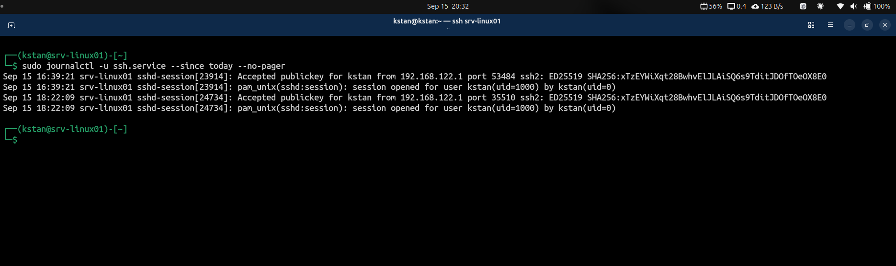

# Linux Process Management and Logs

## Overview

This lab covers basic Linux process monitoring, process termination, resource monitoring, and system log analysis on `srv-linux01`.

## Process Inspection

Show processes in the current terminal:

```bash
ps
```

Show system-wide processes:

```bash
ps aux
ps -ef
```

Find a specific process:

```bash
pgrep -a sshd
```

Show the current shell PID:

```bash
echo $$
```

## Background Processes

Start a process in the background:

```bash
sleep 600 &
```

Show background jobs:

```bash
jobs -l
```

`$!` contains the PID of the most recently started background process.

```bash
echo $!
```

## Process Termination

Terminate a process normally:

```bash
kill -TERM <PID>
```

`SIGTERM` requests a graceful termination.

Force termination when necessary:

```bash
kill -KILL <PID>
```

`SIGKILL` immediately terminates the process.

Use `SIGTERM` before `SIGKILL` during normal troubleshooting.

## Resource Monitoring

Check uptime and system load:

```bash
uptime
```

Check memory:

```bash
free -h
```

Find processes using the most CPU:

```bash
ps aux --sort=-%cpu | head
```

Find processes using the most memory:

```bash
ps aux --sort=-%mem | head
```

Monitor processes interactively:

```bash
top
```

## System Logs

Show logs from the current boot:

```bash
sudo journalctl -b
```

Show errors from the current boot:

```bash
sudo journalctl -b -p err --no-pager
```

Show logs for one service:

```bash
sudo journalctl -u ssh.service --no-pager
```

Filter logs by time:

```bash
sudo journalctl -u ssh.service --since today --no-pager
```

## Troubleshooting Exercise

Journal analysis showed errors from different services.

The investigation included:

1. Identifying the affected service.
2. Checking the service status.
3. Reviewing service-specific logs.
4. Testing network connectivity.
5. Testing DNS resolution.

This demonstrated that log messages should be investigated before changing system configuration.

## Evidence

SSH service logs showed successful public-key authentication:



## Key Lessons

- A PID uniquely identifies a running process.
- A PPID identifies the parent process.
- `SIGTERM` is preferred for normal process termination.
- `SIGKILL` is used when forced termination is necessary.
- `top`, `ps`, and `free` help identify resource problems.
- `journalctl` is a primary troubleshooting tool on systemd systems.
- Service-specific log filtering reduces unnecessary output.
