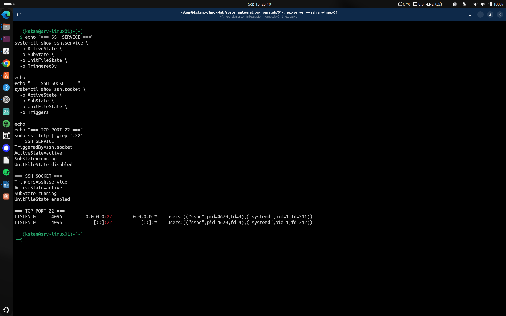

# Linux Service Management with systemd

## Objective

The objective of this stage was to understand how `systemd` manages services and sockets on `srv-linux01`.

I used the OpenSSH server as the practical example because the server already uses SSH for remote administration.

The investigation focused on:

- verifying that `systemd` is the system manager
- inspecting `ssh.service`
- inspecting `ssh.socket`
- understanding active and enabled states
- identifying socket activation
- verifying which process listens on TCP port 22

## Verifying systemd

I confirmed that `systemd` runs as process ID 1:

```bash
ps -p 1 -o pid,comm,args
```

The output was:

```text
PID COMMAND         COMMAND
1   systemd         /usr/lib/systemd/systemd --system --deserialize=154
```

I then checked the installed version:

```bash
systemctl --version
```

The server uses:

```text
systemd 259
```

This confirmed that `systemd` is the system and service manager on `srv-linux01`.

## Inspecting the SSH Service

I inspected the OpenSSH service with:

```bash
systemctl status ssh --no-pager
```

The important state was:

```text
Active: active (running)
Loaded: loaded (...; disabled; preset: enabled)
TriggeredBy: ssh.socket
```

I also verified the service state directly:

```bash
systemctl is-active ssh
systemctl is-enabled ssh
```

The results were:

```text
active
disabled
```

This shows that a service can be active even when its unit file is disabled.

In this configuration, `ssh.socket` triggers `ssh.service`.

## Inspecting the SSH Socket

I inspected the SSH socket unit with:

```bash
systemctl status ssh.socket --no-pager
```

The important state was:

```text
Loaded: loaded (...; enabled; preset: enabled)
Active: active (running)
Triggers: ssh.service
Listen: 0.0.0.0:22
        [::]:22
```

I verified the socket state directly:

```bash
systemctl is-active ssh.socket
systemctl is-enabled ssh.socket
```

The results were:

```text
active
enabled
```

Unlike `ssh.service`, the `ssh.socket` unit is both active and enabled.

The socket listens for incoming SSH connections on TCP port 22.

When an SSH connection requires the service, the socket can trigger `ssh.service`.

## Active and Enabled States

The investigation showed an important difference between an active unit and an enabled unit.

| Unit | Active State | Enabled State |
|---|---|---|
| `ssh.service` | active | disabled |
| `ssh.socket` | active | enabled |

An **active** unit is currently running or operating.

An **enabled** unit is configured to participate in the appropriate systemd startup dependency structure.

Therefore, a unit does not need to be enabled to be active.

On this server, `ssh.service` is active even though it is disabled because `ssh.socket` triggers it.

The relationship is:

```text
Incoming SSH connection
         |
         v
     ssh.socket
   enabled + active
         |
         v
   triggers service
         |
         v
     ssh.service
   disabled + active
         |
         v
        sshd
```


## Inspecting the systemd Unit Files

I inspected the complete unit definition for the SSH service with:

```bash
systemctl cat ssh.service
```

The important sections were:

```text
[Unit]
Description=OpenBSD Secure Shell server
After=network.target nss-user-lookup.target auditd.service

[Service]
ExecStartPre=/usr/sbin/sshd -t
ExecStart=/usr/sbin/sshd -D $SSHD_OPTS
Restart=on-failure
Type=notify

[Install]
WantedBy=multi-user.target
Alias=sshd.service
```

The `[Unit]` section defines general information, conditions, and ordering dependencies.

The `[Service]` section defines how `sshd` starts and behaves while running.

The command:

```bash
/usr/sbin/sshd -t
```

tests the SSH server configuration before the service starts.

The command:

```bash
/usr/sbin/sshd -D
```

starts `sshd` in the foreground so that `systemd` can manage the process.

The setting:

```text
Restart=on-failure
```

instructs `systemd` to restart the service after certain failures.

The `[Install]` section defines how the service participates in the systemd startup structure when enabled.

The line:

```text
WantedBy=multi-user.target
```

associates the service with `multi-user.target` when the service is enabled.

### Inspecting the SSH Socket Unit

I inspected the socket unit with:

```bash
systemctl cat ssh.socket
```

The important configuration was:

```text
[Socket]
ListenStream=0.0.0.0:22
ListenStream=[::]:22
BindIPv6Only=ipv6-only
Accept=no
FreeBind=yes

[Install]
WantedBy=sockets.target
RequiredBy=ssh.service
```

The two `ListenStream` entries configure the socket to listen on TCP port 22 for IPv4 and IPv6.

The setting:

```text
Accept=no
```

means systemd does not start one separate service instance for each incoming connection.

Instead, the main `ssh.service` handles the SSH connections.

The socket participates in `sockets.target` when enabled.


## Verifying TCP Port 22

I verified which processes were associated with TCP port 22:

```bash
sudo ss -lntp | grep ':22'
```

The relevant output showed:

```text
LISTEN ... 0.0.0.0:22 ... users:(("sshd",pid=4670,...),("systemd",pid=1,...))
LISTEN ... [::]:22    ... users:(("sshd",pid=4670,...),("systemd",pid=1,...))
```

This confirmed that SSH was listening on TCP port 22 for both IPv4 and IPv6.

The output also showed file descriptors associated with both `systemd` and `sshd`.

This matches the socket-activated SSH configuration observed on the server.

## Verification Screenshot

The following screenshot shows the SSH service state, SSH socket state, and TCP port 22 verification.


