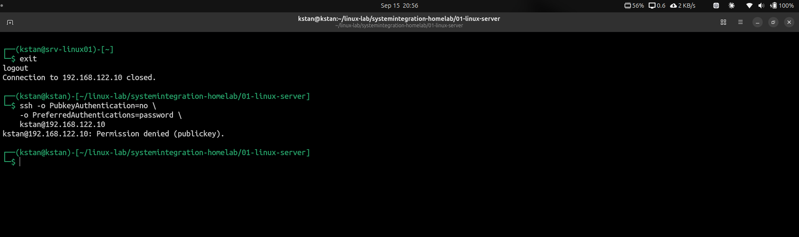

# SSH Administration

## Overview

This lab covers SSH service verification, public-key authentication, and basic SSH hardening on `srv-linux01`.

## Verify the SSH Service

Check the SSH service:

```bash
systemctl status ssh --no-pager
```

Check whether port 22 is listening:

```bash
ss -tlnp | grep ':22'
```

The server listens for SSH connections on TCP port 22.

## Inspect the Effective Configuration

Check important SSH settings:

```bash
sudo sshd -T | grep -E '^(port|permitrootlogin|passwordauthentication|pubkeyauthentication) '
```

The initial configuration allowed both public-key and password authentication.

## Disable Password Authentication

A configuration file was created:

```text
/etc/ssh/sshd_config.d/40-homelab-security.conf
```

It contains:

```text
PasswordAuthentication no
```

Validate the configuration:

```bash
sudo sshd -t
```

Check the effective value:

```bash
sudo sshd -T | grep passwordauthentication
```

Expected result:

```text
passwordauthentication no
```

## Troubleshooting

The first override file was named:

```text
99-homelab-security.conf
```

However, password authentication remained enabled.

Investigation showed that:

```text
50-cloud-init.conf
```

already contained:

```text
PasswordAuthentication yes
```

The homelab configuration was renamed to:

```text
40-homelab-security.conf
```

This caused the required setting to be read first.

This exercise demonstrated the difference between valid configuration syntax and effective configuration.

## Verification

Public-key authentication was tested from the physical host and worked successfully.

Password authentication was then explicitly tested without public-key authentication:

```bash
ssh -o PubkeyAuthentication=no \
    -o PreferredAuthentications=password \
    kstan@192.168.122.10
```

The server rejected the connection:

```text
Permission denied (publickey).
```

This confirms that public-key authentication works and password authentication is disabled.



## Key Lessons

- SSH normally uses TCP port 22.
- `sshd -t` validates SSH configuration syntax.
- `sshd -T` shows the effective SSH configuration.
- Public-key authentication is enabled on this server.
- Password authentication is disabled.
- Configuration load order can affect the effective settings.
- SSH changes should be tested before closing an existing session.
