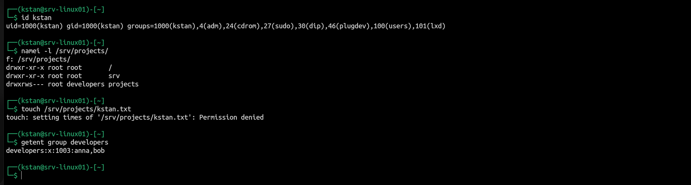

# Linux Users, Groups, and Permissions

## Objective

Configure user accounts and group-based access to a shared Linux directory.

This lab covers:

- User and group management
- File ownership and permissions
- The setgid directory bit
- Permission troubleshooting
- `umask`
- Access Control Lists (ACLs)

## User and Group Configuration

I created two standard users:

```bash
sudo useradd -m -s /bin/bash anna
sudo useradd -m -s /bin/bash bob
```

I created the `developers` group:

```bash
sudo groupadd developers
```

I added the users to the group:

```bash
sudo usermod -aG developers anna
sudo usermod -aG developers bob
```

I verified the configuration with:

```bash
id anna
id bob
getent group developers
```

## Shared Project Directory

I created a shared directory for the development team:

```bash
sudo mkdir -p /srv/projects
sudo chown root:developers /srv/projects
sudo chmod 2770 /srv/projects
```

The directory permissions were:

```text
drwxrws--- root developers /srv/projects
```

The `2` in `2770` enables the setgid bit.

New files and directories inherit the `developers` group.

## Testing Group Access

Anna and Bob could create files in the shared directory:

```bash
sudo -u anna touch /srv/projects/anna.txt
sudo -u bob touch /srv/projects/bob.txt
```

The files inherited the `developers` group:

```text
-rw-r--r-- anna developers anna.txt
-rw-r--r-- bob  developers bob.txt
```

## Troubleshooting a Permission Failure

The `kstan` account initially could not access the shared directory:

```bash
touch /srv/projects/kstan.txt
```

The command returned:

```text
Permission denied
```

I inspected the account and directory permissions:

```bash
id kstan
namei -l /srv/projects
getent group developers
```

The cause was that `kstan` was not a member of the `developers` group.

I corrected the membership:

```bash
sudo usermod -aG developers kstan
```

The existing shell did not immediately receive the new group membership.

I verified this difference with:

```bash
id
id kstan
```

I activated the new group in a new shell:

```bash
newgrp developers
```

After this change, `kstan` could create files in `/srv/projects`.



## File Permissions and umask

Anna and Bob used:

```text
umask 0022
```

Their new files therefore had these permissions:

```text
-rw-r--r--
```

Members of `developers` could read these files but could not modify them.

This demonstrated that directory permissions do not automatically make the files inside the directory group-writable.

## Default ACL Configuration

I installed the ACL utilities:

```bash
sudo apt install acl
```

I configured the shared directory:

```bash
sudo setfacl -m g:developers:rwx /srv/projects
sudo setfacl -m d:g:developers:rwx /srv/projects
```

I inspected the configuration with:

```bash
getfacl /srv/projects
```

New files then received group-write access:

```text
-rw-rw----+ anna developers anna3.txt
-rw-rw----+ bob  developers bob3.txt
```

The `+` indicates that extended ACL entries are present.

## Verification

I tested cross-user access by allowing Bob to modify a file created by Anna:

```bash
sudo -u bob sh -c 'echo "Bob updated Anna file" >> /srv/projects/anna3.txt'
```

The operation succeeded.

This confirmed that members of the `developers` group could collaborate in the shared directory while access for other users remained restricted.

## Key Lessons

- Users can have a primary group and supplementary groups.
- `usermod -aG` adds a user to a supplementary group.
- `chown` changes file or directory ownership.
- `chmod` controls standard Linux permissions.
- The setgid bit makes new content inherit the directory group.
- Group membership changes may require a new login session.
- `namei -l` helps diagnose path permission problems.
- `umask` affects permissions assigned to new files.
- Default ACLs provide consistent permissions in shared directories.
- `getfacl` and `setfacl` inspect and configure ACLs.
