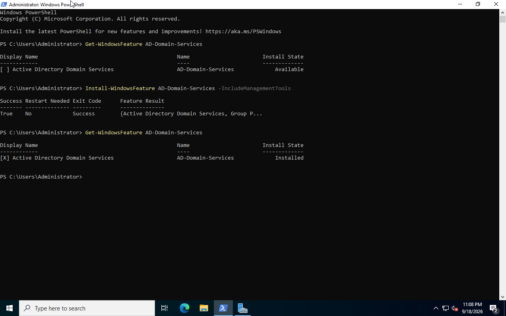
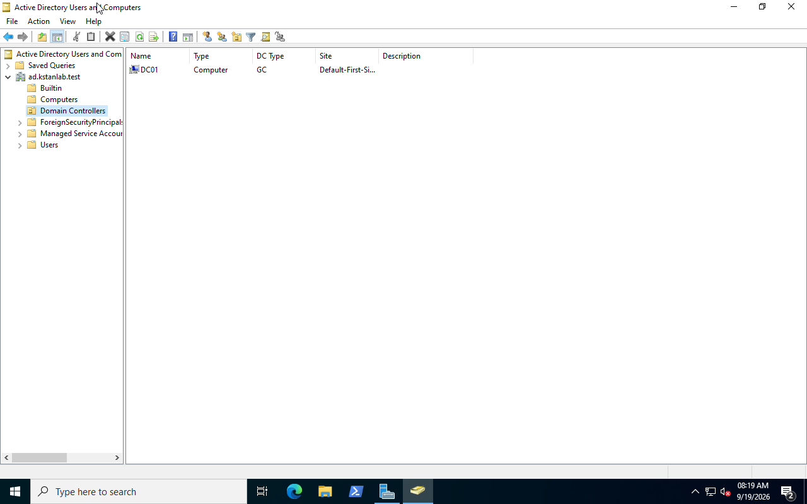
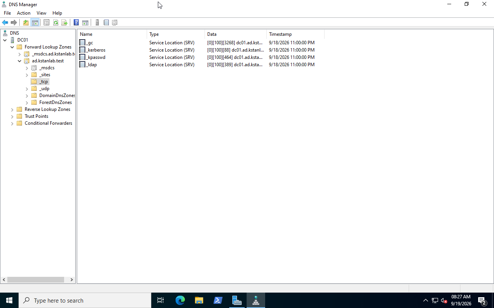
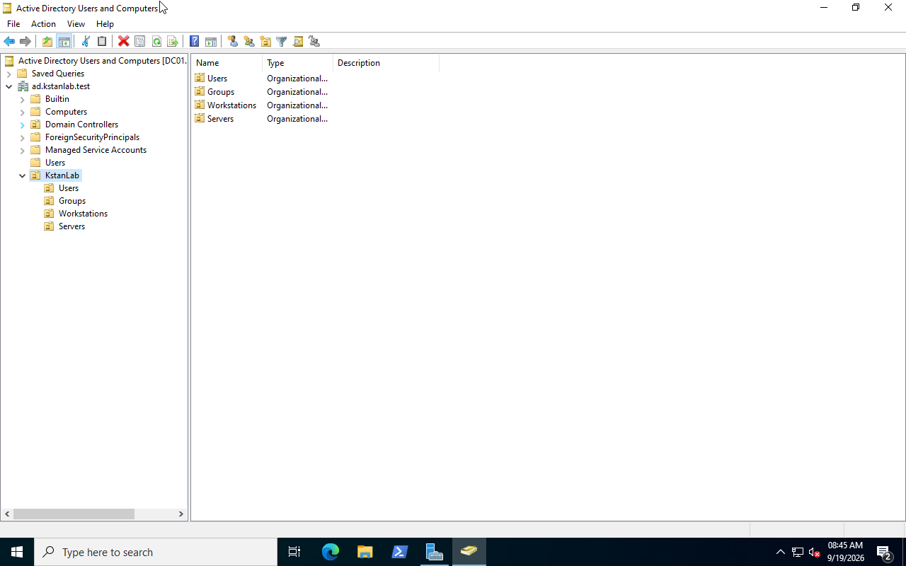
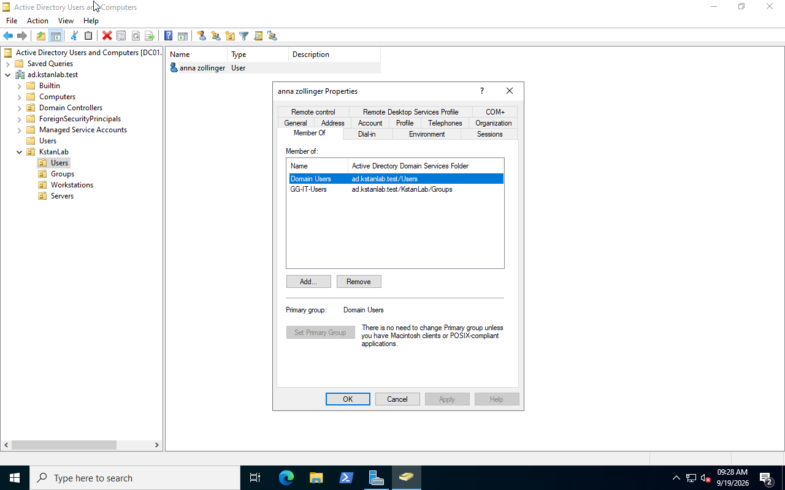
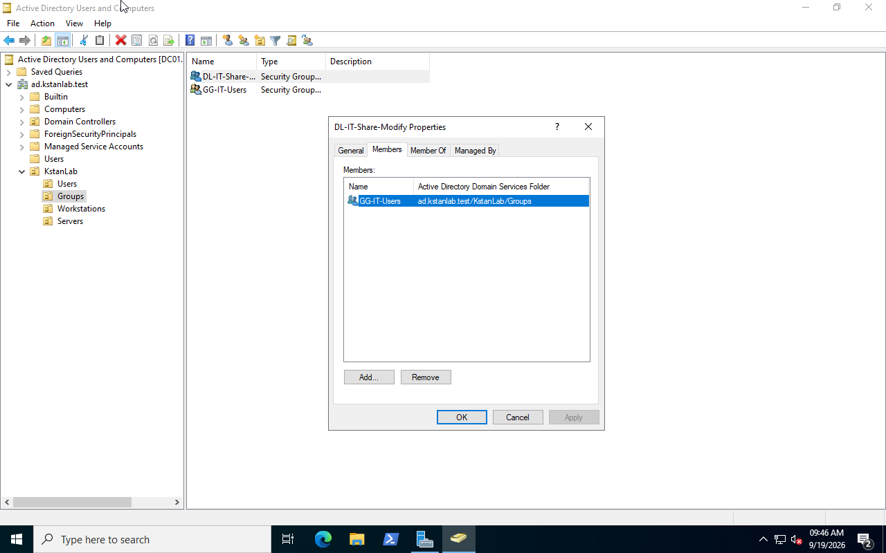
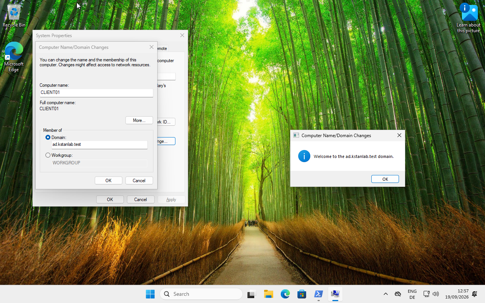
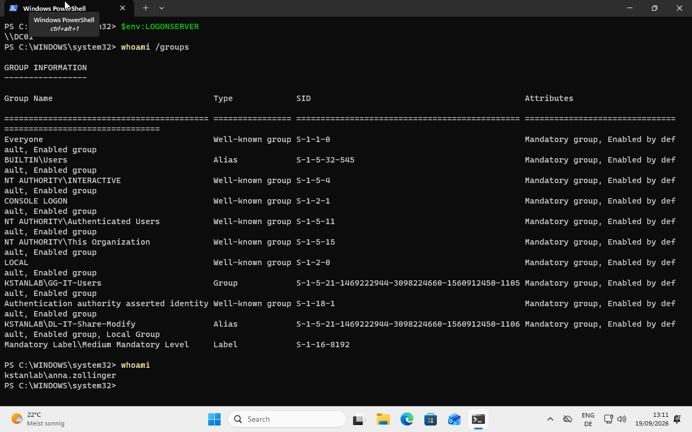

# Active Directory Domain Services

## Overview

This lab configures `DC01` as the first domain controller for a new Active Directory forest.

The domain is:

```text
ad.kstanlab.test
```

The NetBIOS domain name is:

```text
KSTANLAB
```

The environment uses one Windows Server 2022 domain controller and one Windows 11 domain client.

## Active Directory Domain Services

The Active Directory Domain Services role was installed on `DC01`.

The DNS Server role was installed with AD DS because Active Directory depends on DNS for domain-controller and service discovery.



## New Forest

A new forest was created with:

```text
Root domain:              ad.kstanlab.test
NetBIOS domain:           KSTANLAB
Forest functional level:  Windows Server 2016
Domain functional level:  Windows Server 2016
DNS Server:               Enabled
Global Catalog:           Enabled
RODC:                     Disabled
```

### Functional levels

The functional level determines which Active Directory features and domain-controller versions the forest or domain can support.

Windows Server 2016 is the highest functional level offered during this Windows Server 2022 deployment.

### DNS Server

DNS is essential to Active Directory.

Domain clients use DNS to locate domain controllers and services such as LDAP and Kerberos.

### Global Catalog

The Global Catalog stores searchable information about Active Directory objects.

`DC01` is the first domain controller in the forest and is configured as a Global Catalog server.

### Read-Only Domain Controller

RODC is intended for scenarios such as branch offices where a read-only copy of Active Directory is required.

`DC01` is a normal writable domain controller.

## Directory Services Restore Mode

A Directory Services Restore Mode password was configured during promotion.

DSRM provides a special recovery mode for Active Directory maintenance and recovery.

The password is not stored in this repository.

## Active Directory Data Locations

The deployment uses the default locations:

```text
Database: C:\Windows\NTDS
Logs:     C:\Windows\NTDS
SYSVOL:   C:\Windows\SYSVOL
```

### NTDS

`C:\Windows\NTDS` contains the Active Directory database.

The main database file is:

```text
ntds.dit
```

It stores directory information such as:

- users
- computers
- groups
- organizational units
- domain configuration

The directory also contains transaction logs used for database consistency and recovery.

### SYSVOL

`C:\Windows\SYSVOL` contains domain files that must be available to domain computers.

It is used for items such as:

- Group Policy files
- logon scripts
- startup scripts

Parts of Group Policy are stored in SYSVOL.

### Why use the default locations?

Production domain controllers can place the database, logs, and SYSVOL on separate storage for performance, capacity, or recovery requirements.

This lab domain controller has one 60 GB system disk, so separate locations provide no useful benefit.

## Domain Controller Verification

After promotion and restart, `DC01` was verified as a domain controller for:

```text
ad.kstanlab.test
```

The server is also a Global Catalog server.



## DNS Service Discovery

Active Directory creates DNS service records that allow clients to locate domain services.

Important examples include:

```text
_ldap       LDAP directory service
_kerberos   Kerberos authentication
_gc         Global Catalog
_kpasswd    Kerberos password-change service
```

The DNS records on `DC01` were verified after domain creation.



## Organizational Unit Structure

A top-level OU named `KstanLab` was created.

It contains:

```text
KstanLab
├── Users
├── Groups
├── Workstations
└── Servers
```

Organizational Units provide a structure for administration, delegation, and Group Policy targeting.



## Domain User

A domain user was created in:

```text
KstanLab\Users
```

User:

```text
anna.zollinger
```

The account was configured to require a password change at the first logon.

Passwords are not stored in this repository.

## Security Groups

A Global security group was created:

```text
GG-IT-Users
```

Anna was added to this group.

The Global group describes the user's organizational role:

```text
Anna is an IT user.
```



A Domain Local security group was also created:

```text
DL-IT-Share-Modify
```

This group describes access to a resource:

```text
Members receive Modify access to the IT share.
```

`GG-IT-Users` was added to `DL-IT-Share-Modify`.

This creates the following group structure:

```text
Anna Zollinger
      ↓
GG-IT-Users
      ↓
DL-IT-Share-Modify
```



This follows the AGDLP model:

```text
Accounts
   ↓
Global groups
   ↓
Domain Local groups
   ↓
Permissions
```

Permissions can therefore be assigned to resource groups instead of directly to individual user accounts.

## Windows 11 Domain Client

A Windows 11 Pro virtual machine named `CLIENT01` was created as the domain workstation.

Before joining the domain, its DNS server was configured as:

```text
192.168.122.20
```

This is the address of `DC01`.

DNS resolution was tested with:

```powershell
Resolve-DnsName ad.kstanlab.test
```

The domain-controller LDAP SRV record was also tested:

```powershell
Resolve-DnsName -Type SRV _ldap._tcp.dc._msdcs.ad.kstanlab.test
```

The lookup returned:

```text
Target: dc01.ad.kstanlab.test
Port:   389
IP:     192.168.122.20
```

This verified that `CLIENT01` could discover the domain controller through Active Directory DNS.

## Domain Join

`CLIENT01` was joined to:

```text
ad.kstanlab.test
```

Windows confirmed the successful domain join.



After restart, `anna.zollinger` logged on to `CLIENT01` with the `KSTANLAB` domain.

The required password change was completed during the first domain logon.

The session was verified with:

```powershell
whoami
$env:LOGONSERVER
whoami /groups
```

The results confirmed:

```text
User:         KSTANLAB\anna.zollinger
Logon server: \\DC01
```

The security token also contained:

```text
KSTANLAB\GG-IT-Users
KSTANLAB\DL-IT-Share-Modify
```



## Result

The Active Directory environment now provides:

- a functioning Windows Server 2022 domain controller
- Active Directory-integrated DNS
- a custom OU structure
- domain users and security groups
- nested Global and Domain Local groups
- a Windows 11 domain client
- domain-controller discovery through DNS
- successful domain authentication
- verified nested group membership

The next stage applies these groups to shared-resource permissions.
