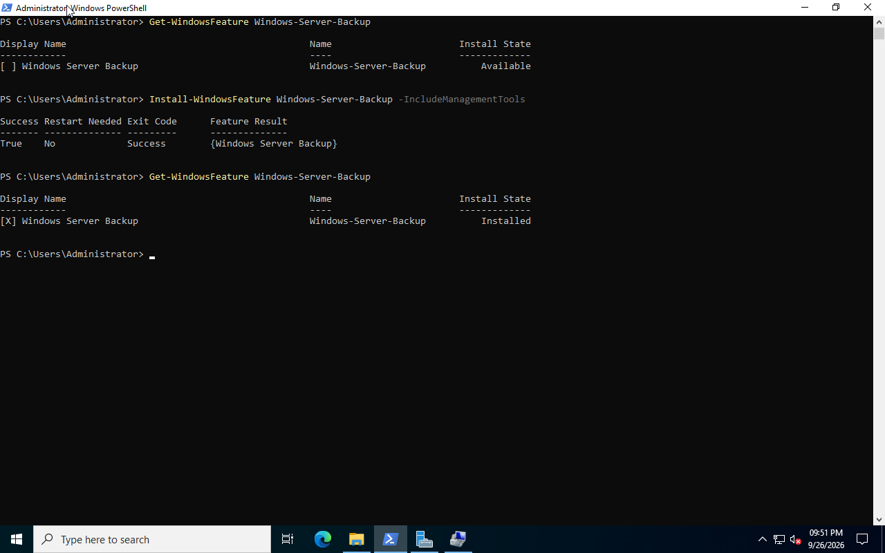
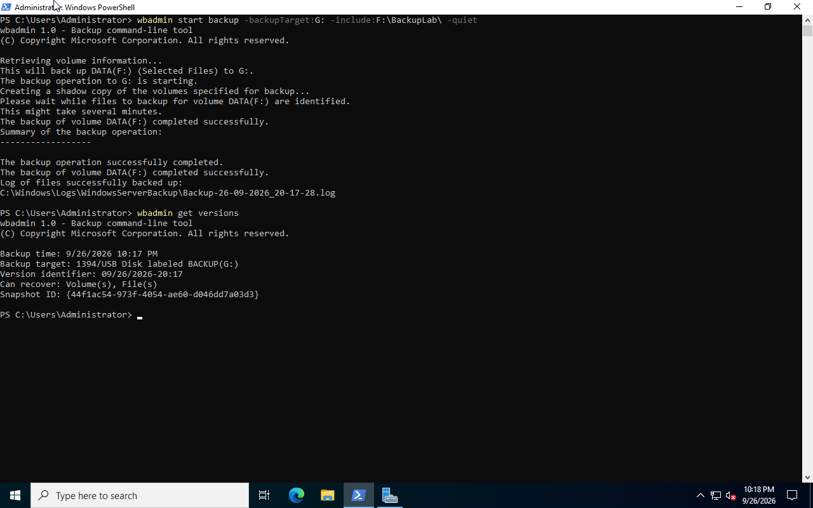
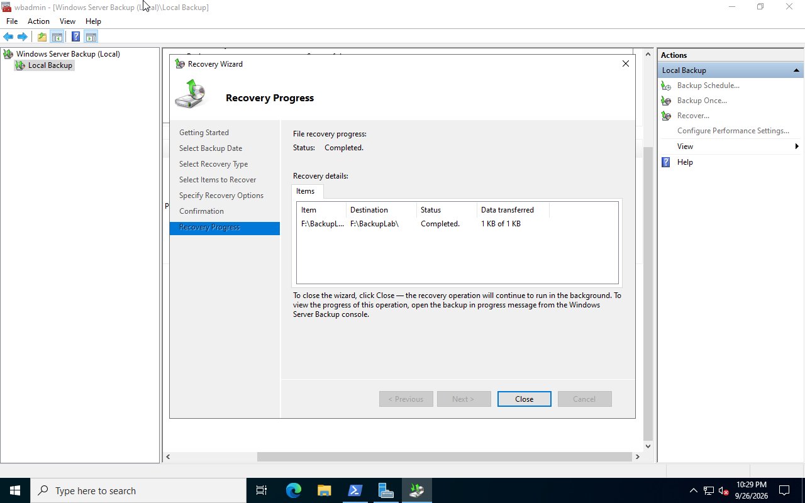
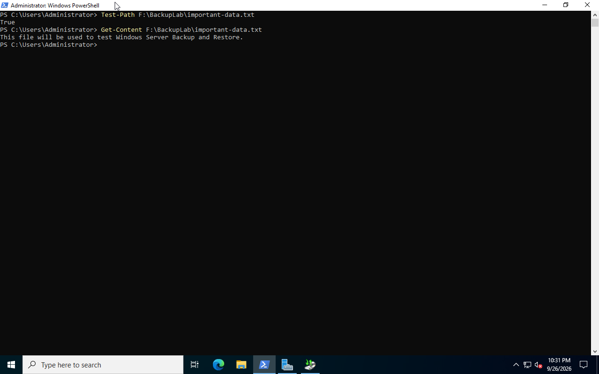

# Windows Server Backup and Restore

This section demonstrates file backup and recovery with Windows Server Backup on `DC01`.

## Objective

The objective was to back up test data to a separate virtual disk, simulate accidental file deletion, and restore the deleted file.

## Environment

- Server: `DC01`
- Operating system: Windows Server 2022
- Backup tool: Windows Server Backup
- Source volume: `DATA (F:)`
- Backup destination: `BACKUP (G:)`
- Backup disk: 30 GB QCOW2
- File system: NTFS

## 1. Install Windows Server Backup

Windows Server Backup was installed with PowerShell:

```powershell
Install-WindowsFeature Windows-Server-Backup -IncludeManagementTools
```

The installation was verified with:

```powershell
Get-WindowsFeature Windows-Server-Backup
```

The feature reported an `Installed` state.



## 2. Prepare the Test Data

A test folder and file were created on the `DATA (F:)` volume:

```powershell
New-Item -Path F:\BackupLab -ItemType Directory

"This file will be used to test Windows Server Backup and Restore." |
Out-File F:\BackupLab\important-data.txt
```

The file was used to test backup and recovery.

## 3. Configure the Backup Destination

A separate 30 GB QCOW2 virtual disk was attached to `DC01`.

The disk was configured as:

- Partition style: GPT
- Drive letter: `G:`
- Volume label: `BACKUP`
- File system: NTFS

This kept the backup destination separate from the source volume.

## 4. Create the Backup

A one-time backup of `F:\BackupLab` was created with `wbadmin`:

```powershell
wbadmin start backup -backupTarget:G: -include:F:\BackupLab -quiet
```

Available backup versions were verified with:

```powershell
wbadmin get versions
```

The backup completed successfully and created a recoverable version on `BACKUP (G:)`.



## 5. Simulate File Loss

The test file was intentionally deleted:

```powershell
Remove-Item F:\BackupLab\important-data.txt
```

The deletion was verified with:

```powershell
Test-Path F:\BackupLab\important-data.txt
```

The command returned:

```text
False
```

This simulated accidental deletion of user data.


## 6. Restore the File with the GUI

The deleted file was restored with the Windows Server Backup graphical interface.

### Recovery Steps

1. Open **Server Manager** on `DC01`.
2. Select **Tools > Windows Server Backup**.
3. In the **Actions** pane, select **Recover...**.
4. Select **This server (DC01)** as the backup location.
5. Select the backup date and time created during the lab.
6. For the recovery type, select **Files and folders**.
7. Browse the backup and select:

   ```text
   F:\BackupLab\important-data.txt

8. Select Original location as the recovery destination.
9. Review the recovery settings.
10. Select Recover to start the restoration.
11. Wait until the Recovery Wizard reports:

The recovery operation completed successfully.



## 7. Verify the Recovery

PowerShell was used to confirm that the restored file existed:

```powershell
Test-Path F:\BackupLab\important-data.txt
```

The result was:

```text
True
```

The restored file contents were then verified:

```powershell
Get-Content F:\BackupLab\important-data.txt
```

Output:

```text
This file will be used to test Windows Server Backup and Restore.
```



## Result

The backup and recovery workflow was completed successfully:

```text
Create test data
      ↓
Back up to BACKUP (G:)
      ↓
Delete the original file
      ↓
Restore with Windows Server Backup
      ↓
Verify the restored file with PowerShell
```

This lab demonstrates basic Windows Server backup administration and file-level disaster recovery.
