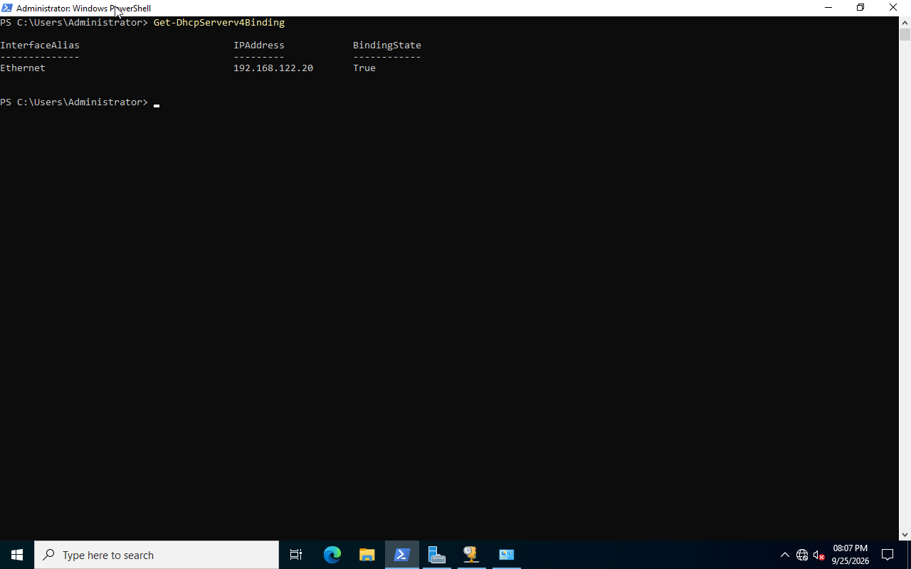
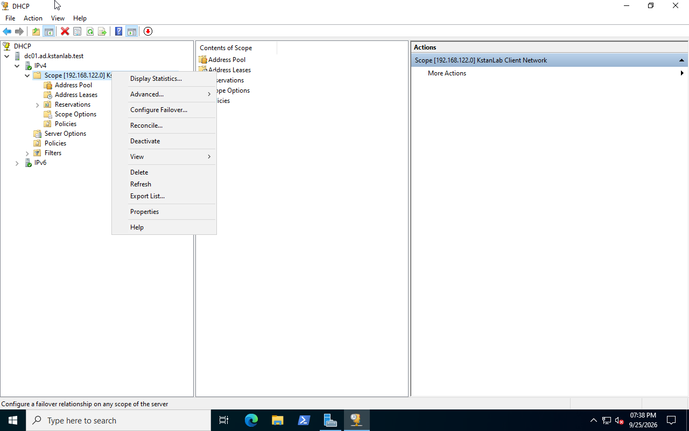
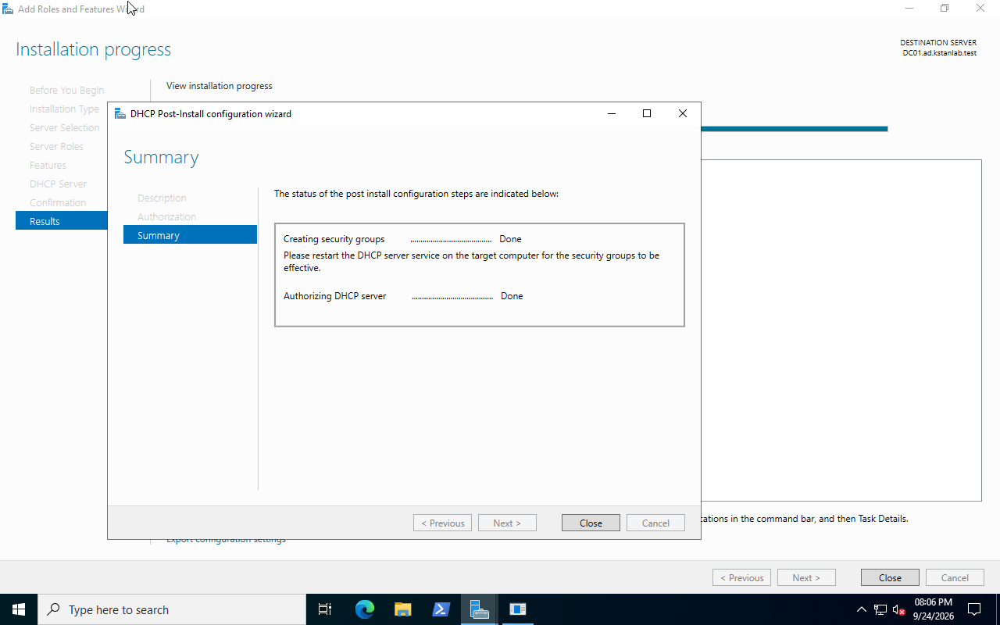
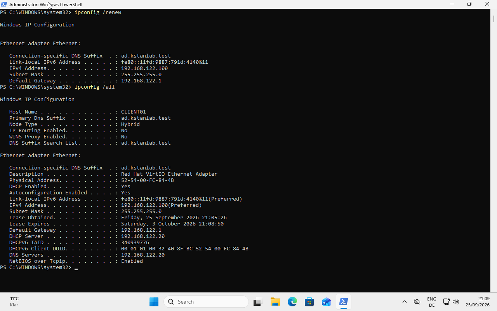

# Windows Server DHCP

## Overview

I configured DC01 as the DHCP server for the KstanLab network.

The Windows Server DHCP service replaced the DHCP service previously provided by the libvirt default network.

## Network Configuration

| Setting | Value |
|---|---|
| DHCP server | DC01 |
| Server IP | 192.168.122.20 |
| Network | 192.168.122.0/24 |
| Default gateway | 192.168.122.1 |
| DHCP range | 192.168.122.100 - 192.168.122.200 |
| DNS server | 192.168.122.20 |
| DNS domain | ad.kstanlab.test |
| Lease duration | 8 days |

DC01 uses the static IPv4 address `192.168.122.20`.

## DHCP Server Configuration

I installed the DHCP Server role on DC01 and authorized the server in Active Directory.

The IPv4 scope `192.168.122.0/24` was configured and activated.

## Client Test

CLIENT01 initially received an APIPA address because it could not contact the Windows DHCP server.

The client used an address in the `169.254.0.0/16` range.

After troubleshooting the virtual network, CLIENT01 successfully received:

- IPv4 address: `192.168.122.100`
- Default gateway: `192.168.122.1`
- DHCP server: `192.168.122.20`
- DNS server: `192.168.122.20`

## Troubleshooting

The DHCP configuration was correct, but CLIENT01 could not initially obtain a lease.

I verified:

- DHCP Server service was running.
- DC01 was authorized in Active Directory.
- The DHCP scope was active.
- DHCP was bound to `192.168.122.20`.
- Windows Firewall allowed DHCP traffic.
- DC01 was listening on UDP port 67.

A packet capture on the Ubuntu host showed DHCP requests from CLIENT01, but DC01 did not receive them.

The cause was the libvirt virtual network. After the libvirt network was restarted, DC01's existing `vnet0` interface was no longer attached to the `virbr0` bridge.

A full shutdown and start of DC01 recreated its virtual interface and attached it correctly to `virbr0`.

CLIENT01 then obtained `192.168.122.100` from DC01.

## What I Learned

This lab demonstrated that a DHCP failure is not always caused by the DHCP service.

I used DHCP statistics, Windows networking tools, `tcpdump`, `bridge`, and libvirt commands to isolate the problem between the client, virtual bridge, and DHCP server.
