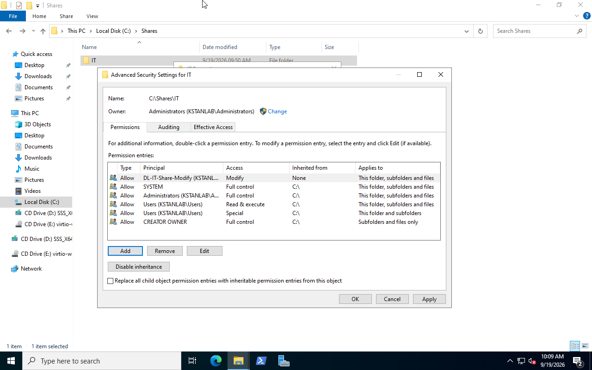
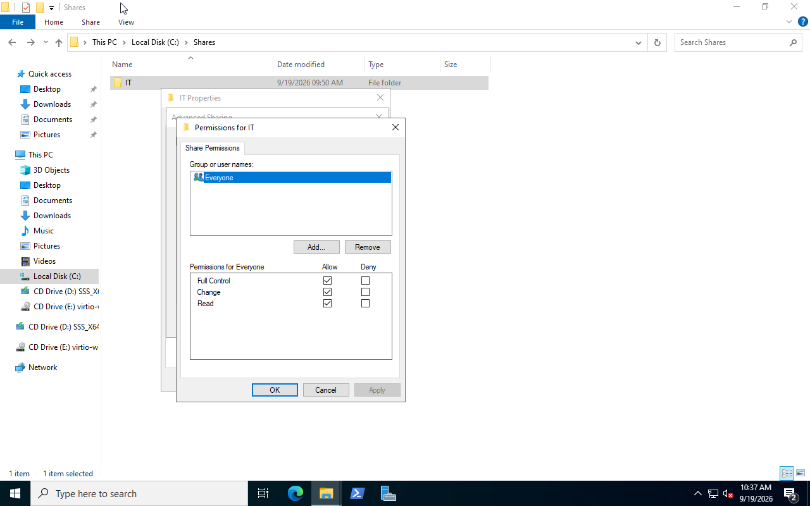
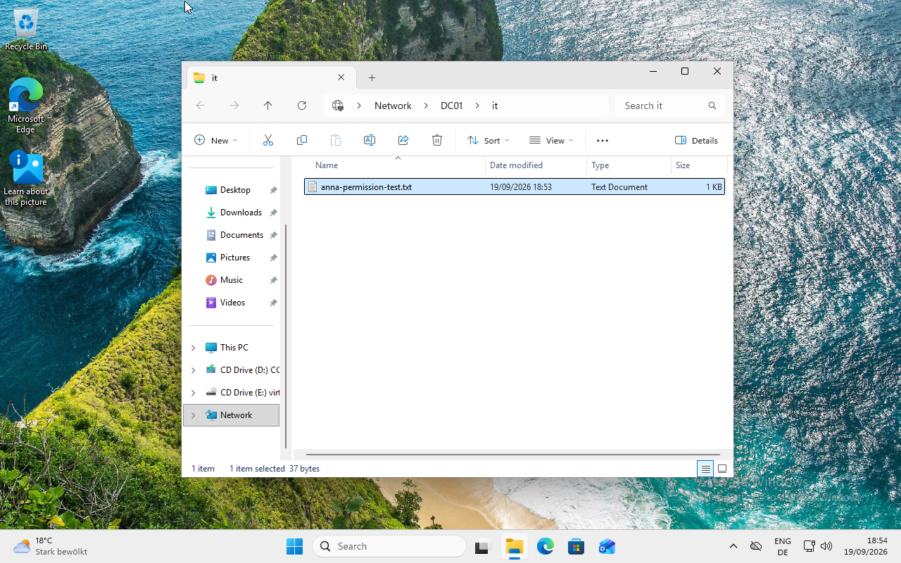

# SMB File Sharing and Permissions

## Overview

This lab configures a shared IT folder on `DC01` and controls access with Active Directory security groups.

The permission model is:

```text
Anna Zollinger
      ↓
GG-IT-Users
      ↓
DL-IT-Share-Modify
      ↓
NTFS Modify
      ↓
C:\Shares\IT
```

## Shared Folder

The following folder was created on `DC01`:

```text
C:\Shares\IT
```

It was shared as:

```text
\\DC01\IT
```

## NTFS Permission

The following Domain Local group received `Modify` permission:

```text
KSTANLAB\DL-IT-Share-Modify
```

The permission applies to:

```text
This folder, subfolders and files
```



The existing inherited NTFS permissions were retained.

The user account was not granted permission directly.

## SMB Share Permission

The SMB share was configured with:

```text
Everyone: Full Control
```



The SMB layer is intentionally permissive in this lab. The NTFS ACL controls access through the Active Directory security group.

For network access, both share and NTFS permissions apply.

## Permission Verification

The NTFS ACL was verified with:

```powershell
icacls C:\Shares\IT
```

The important entry was:

```text
KSTANLAB\DL-IT-Share-Modify:(OI)(CI)(M)
```

Where:

```text
(OI) = Object Inherit
(CI) = Container Inherit
(M)  = Modify
```

## Client Access Test

Anna logged on to `CLIENT01` as:

```text
KSTANLAB\anna.zollinger
```

She accessed:

```text
\\DC01\IT
```

No additional credentials were required.

Anna then successfully:

- opened the share
- created a text file
- wrote and saved content
- deleted the file



This verified that the `Modify` permission works from the domain client.

## Result

The complete authorization path is:

```text
anna.zollinger
      ↓
GG-IT-Users
      ↓
DL-IT-Share-Modify
      ↓
NTFS Modify
      ↓
\\DC01\IT
```

Access is controlled through security groups instead of direct user permissions.

This makes the permission structure easier to manage and follows the AGDLP model used in Active Directory environments.
