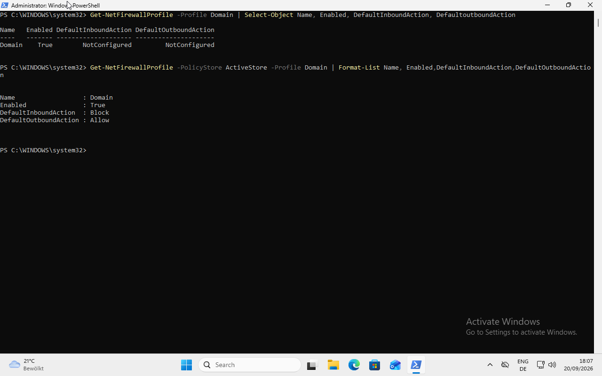
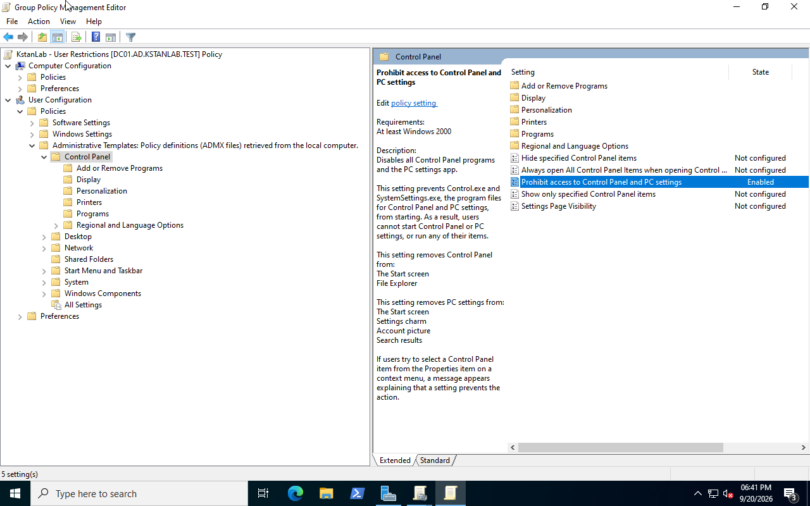
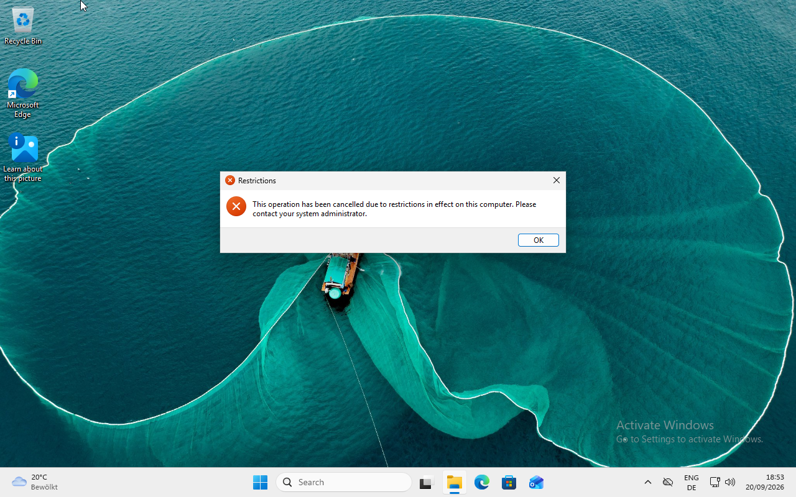

# Group Policy Management

## Overview

This lab uses Group Policy to centrally manage computer and user settings in the Active Directory domain.

Two Group Policy Objects were configured:

| GPO | Linked OU | Policy type |
|---|---|---|
| `KstanLab - Workstation Security` | `Workstations` | Computer Configuration |
| `KstanLab - User Restrictions` | `Users` | User Configuration |

This demonstrates the difference between policies that target computer objects and policies that target user objects.

## OU Structure

The relevant Active Directory structure is:

```text
KstanLab
├── Users
│   └── anna.zollinger
└── Workstations
    └── CLIENT01
```

The computer account `CLIENT01` was moved from the default `Computers` container to the `Workstations` OU.

This allows workstation-specific GPOs to target the computer through its OU.

## Workstation Security GPO

A GPO named:

```text
KstanLab - Workstation Security
```

was created and linked to:

```text
KstanLab\Workstations
```

The GPO uses **Computer Configuration** because the policy must apply to the workstation rather than to a specific user.

### Windows Defender Firewall

The Domain firewall profile was configured with:

```text
Firewall state:       On
Inbound connections:  Block
Outbound connections: Allow
```

The policy was refreshed on `CLIENT01` with:

```powershell
gpupdate /force
```

Computer policy application was verified with:

```powershell
gpresult /scope computer /r
```

The result showed:

```text
Applied Group Policy Objects
-----------------------------
KstanLab - Workstation Security
Default Domain Policy
```

The effective firewall configuration was also checked with:

```powershell
Get-NetFirewallProfile -PolicyStore ActiveStore -Profile Domain |
    Format-List Name,Enabled,DefaultInboundAction,DefaultOutboundAction
```

The effective configuration was:

```text
Name                  : Domain
Enabled               : True
DefaultInboundAction  : Block
DefaultOutboundAction : Allow
```

This confirms that the workstation GPO was applied successfully.



## User Restrictions GPO

A second GPO was created:

```text
KstanLab - User Restrictions
```

It was linked to:

```text
KstanLab\Users
```

This GPO uses **User Configuration** because it controls the environment of domain users stored in the `Users` OU.

The following policy was enabled:

```text
User Configuration
└── Policies
    └── Administrative Templates
        └── Control Panel
            └── Prohibit access to Control Panel and PC settings
```



## User Policy Verification

The domain user `KSTANLAB\anna.zollinger` signed in to `CLIENT01`.

Policy was refreshed with:

```powershell
gpupdate /force
```

User policy application was verified with:

```powershell
gpresult /scope user /r
```

The result showed:

```text
Applied Group Policy Objects
-----------------------------
KstanLab - User Restrictions
```

This confirms that the user GPO reached the domain user through the `Users` OU.

## Restriction Test

While signed in as `anna.zollinger`, an attempt was made to open Control Panel.

Windows blocked the operation and displayed a restrictions message.



This confirms that the configured user policy was successfully enforced on the domain client.

## Computer Configuration vs User Configuration

This lab demonstrates an important Group Policy distinction.

```text
CLIENT01
   ↓
Workstations OU
   ↓
KstanLab - Workstation Security
   ↓
Computer Configuration
```

Computer Configuration follows the **computer object**.

```text
anna.zollinger
   ↓
Users OU
   ↓
KstanLab - User Restrictions
   ↓
User Configuration
```

User Configuration follows the **user object**.

The OU containing the relevant Active Directory object therefore affects which linked GPOs apply.

## Troubleshooting Commands

The main commands used to troubleshoot and verify Group Policy were:

```powershell
gpupdate /force
```

Refresh Group Policy.

```powershell
gpresult /scope computer /r
```

Display GPOs applied to the computer.

```powershell
gpresult /scope user /r
```

Display GPOs applied to the current user.

These commands help distinguish between successful policy processing and the actual GPOs that were applied.

## Result

The Group Policy lab successfully demonstrated:

- creation and linking of GPOs
- OU-based policy targeting
- Computer Configuration
- User Configuration
- Windows Defender Firewall management
- user restrictions
- policy refresh with `gpupdate`
- policy verification with `gpresult`
- effective firewall policy verification
- practical testing from a domain client
