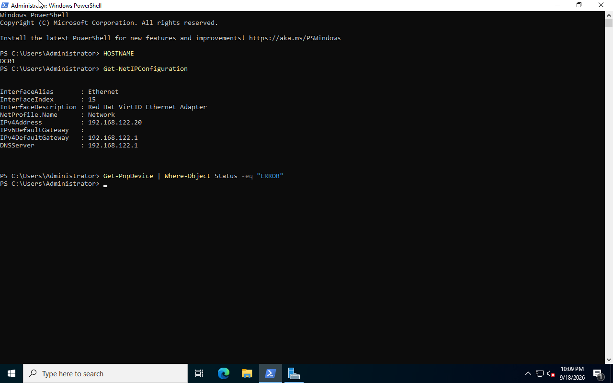

# Windows Server 2022 Installation

## Overview

This document describes the deployment of Windows Server 2022 for my system integration homelab.

The server runs as a virtual machine on KVM/QEMU with libvirt. It will be used as the domain controller for the Active Directory lab.

## Virtual Machine Configuration

The virtual machine was created with the following resources:

| Component | Configuration |
|---|---|
| VM name | `dc01` |
| Operating system | Windows Server 2022 Standard Evaluation |
| Installation type | Desktop Experience |
| Hypervisor | KVM/QEMU with libvirt |
| Memory | 4 GB |
| CPUs | 4 vCPUs |
| System disk | 60 GB QCOW2 |
| Disk interface | VirtIO |
| Network interface | VirtIO |
| Network | libvirt `default` |

The Windows Server installation ISO and VirtIO driver ISO were attached to the virtual machine.

## VirtIO Storage Driver

Windows Setup did not initially detect the 60 GB virtual disk.

This occurred because the virtual disk uses the VirtIO interface and Windows Server did not have the required driver.

The VirtIO storage driver was loaded from the attached VirtIO ISO during Windows Setup.

After the driver was loaded, Windows detected the 60 GB virtual disk and installation continued.

## Windows Server Installation

Windows Server 2022 Standard Evaluation with Desktop Experience was installed.

After installation, the built-in `Administrator` account was configured and used for the initial server administration.

The automatically generated Windows computer name was later changed to:

```text
DC01
```

The new hostname was verified with:

```powershell
hostname
```

## VirtIO Network Driver

After installation, Windows did not initially detect the VirtIO network interface.

The network driver was installed from:

```text
NetKVM\2k22\amd64
```

Windows then detected the interface as:

```text
Red Hat VirtIO Ethernet Adapter
```

The network configuration was verified with:

```powershell
Get-NetAdapter
Get-NetIPConfiguration
```

## Network Configuration

The virtual machine is connected to the libvirt `default` network:

```text
Network: 192.168.122.0/24
Gateway: 192.168.122.1
```

A DHCP reservation was configured in libvirt for DC01:

```text
MAC address: 52:54:00:f4:0f:54
IPv4 address: 192.168.122.20
Hostname: dc01
```

The final network configuration is:

```text
Hostname: DC01
IPv4:     192.168.122.20
Gateway:  192.168.122.1
DNS:      192.168.122.1
```

Connectivity to the gateway, Internet, and external DNS was tested successfully.

## VirtIO Guest Tools

The VirtIO Guest Tools package was installed from the VirtIO driver ISO.

After installation and restart, device status was checked with:

```powershell
Get-PnpDevice | Where-Object Status -eq "Error"
```

No devices with an error status were reported.

## Windows Update

Windows Update was completed before installing server roles.

During one restart, Windows remained on the following message for an extended period:

```text
Shutting down service: Update Orchestrator Service.
```

The VM was not forcibly powered off.

Disk activity was inspected from the Linux host with:

```bash
sudo virsh -c qemu:///system domstats dc01 --block
```

The disk counters continued to increase. This showed that the guest was still processing data.

Windows completed the update and restarted normally.

## Final Verification

After the final restart, the server configuration was verified again.

```powershell
hostname
Get-NetIPConfiguration
Get-PnpDevice | Where-Object Status -eq "Error"
```

The server retained the expected hostname and network configuration.



## Result

The Windows Server 2022 baseline is complete.

DC01 now has:

- Windows Server 2022 with Desktop Experience
- VirtIO storage and network drivers
- VirtIO Guest Tools
- Hostname `DC01`
- Reserved IPv4 address `192.168.122.20`
- Working gateway, Internet, and DNS connectivity
- Current Windows updates
- No reported Plug and Play device errors

The server is ready for Active Directory Domain Services configuration.
