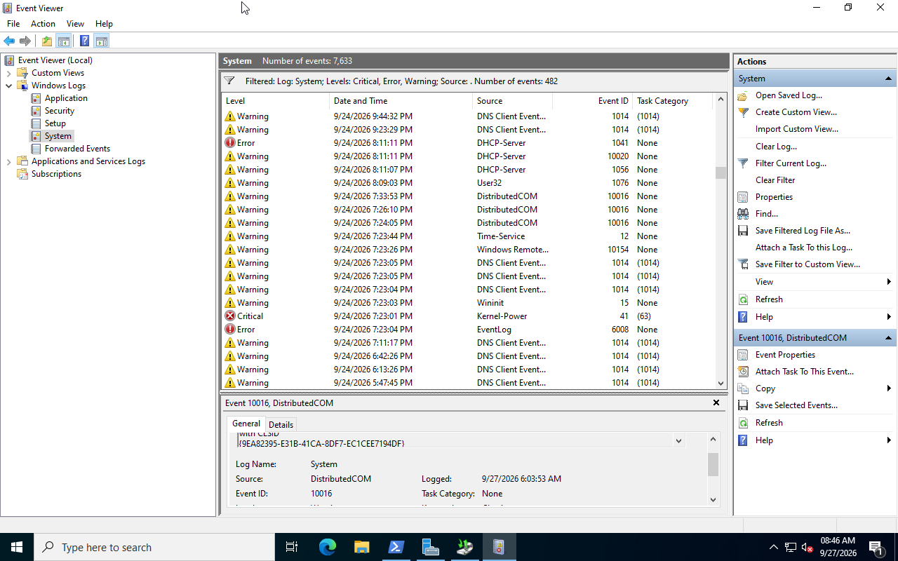
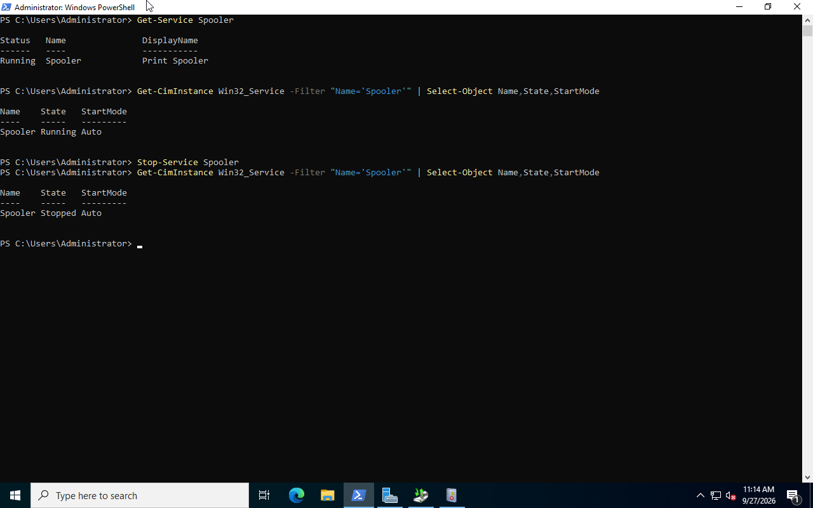

# Windows Server Monitoring and Event Viewer

This section demonstrates basic Windows Server monitoring, service checks, and event log investigation on `DC01`.

## Environment

- Server: `DC01`
- Operating system: Windows Server 2022
- Domain: `ad.kstanlab.test`
- Tools: PowerShell and Event Viewer

## 1. Monitor Important Services

PowerShell was used to verify important domain services.

```powershell
Get-Service ADWS,DNS,DHCPServer,Netlogon
```

The services were running successfully.

A general service check was also performed:

```powershell
Get-Service | Where-Object Status -eq "Running" | Measure-Object
```

## 2. Investigate Windows Event Logs

Event Viewer was opened from:

`Event Viewer > Windows Logs > System`

The System log was filtered for:

- Critical
- Error
- Warning


### Event Viewer System Log



This showed events from services including DNS, DHCP Server, DistributedCOM, and Kernel-Power.

A DHCP Server warning with Event ID `10020` was investigated.

The event reported that the server had a dynamically assigned IPv6 address and recommended using static IPv6 addresses for reliable DHCPv6 operation.

PowerShell was also used to query the event:

```powershell
Get-WinEvent -FilterHashtable @{LogName='System'; Id=10020} -MaxEvents 3 | Format-List TimeCreated,Id,LevelDisplayName,ProviderName,Message
```

This demonstrated how Event Viewer and PowerShell can be used together during troubleshooting.

## 3. Service Monitoring Exercise

The Print Spooler service was used for a controlled service monitoring test.

The initial service state was checked:

```powershell
Get-Service Spooler
```

The startup configuration was checked:

```powershell
Get-CimInstance Win32_Service -Filter "Name='Spooler'" | Select-Object Name,State,StartMode
```

The initial state was:

```text
State: Running
StartMode: Auto
```

The service was then stopped:

```powershell
Stop-Service Spooler
```

A second check showed:

```text
State: Stopped
StartMode: Auto
```

### Service State Verification


This demonstrated that the current service state and the configured startup mode are separate properties.

The System log was filtered by the `Service Control Manager` event source.

A recent-event query was also tested:

```powershell
Get-WinEvent -FilterHashtable @{LogName='System'; ProviderName='Service Control Manager'; StartTime=(Get-Date).AddMinutes(-15)} | Select-Object TimeCreated,Id,LevelDisplayName,Message
```

No matching Service Control Manager events were found for the selected time period.

The Print Spooler was then restored:

```powershell
Start-Service Spooler
Get-Service Spooler
```

The service returned to the `Running` state.

## Key Skills Practiced

- checking Windows service status
- distinguishing service state from startup mode
- using Event Viewer
- filtering Windows System events
- identifying Event IDs and event sources
- querying event logs with `Get-WinEvent`
- investigating service-related events with PowerShell
- safely stopping and restoring a Windows service
