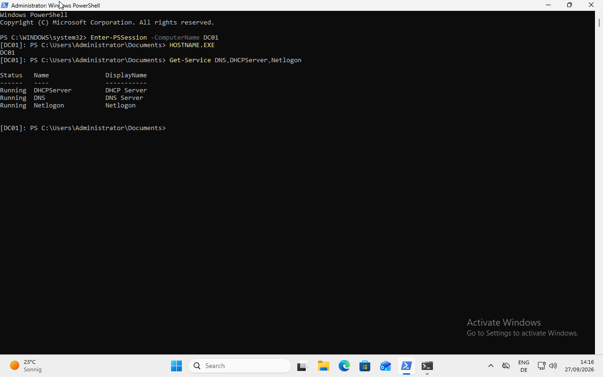

# Windows Server Remote Administration

This section demonstrates remote administration of the Windows Server domain controller `DC01` from the Windows 11 domain client `CLIENT01`.

PowerShell Remoting and Windows Remote Management (WinRM) were used to connect to the server and run administrative commands remotely.

##  Environment

| System | Role | IP Address |
|---|---|---|
| `DC01` | Windows Server 2022 Domain Controller | `192.168.122.20` |
| `CLIENT01` | Windows 11 Pro domain client | DHCP |
| Domain | Active Directory domain | `ad.kstanlab.test` |

The remote administration connection was made from `CLIENT01` to `DC01`.

---

## 1. Verify WinRM on DC01

The Windows Remote Management service was checked on `DC01`.

```powershell
Get-Service WinRM
```

The service was running.

The configured WinRM listener was then checked:

```powershell
winrm enumerate winrm/config/listener
```

The server had an HTTP WinRM listener configured on:

```text
TCP 5985
```

This confirmed that `DC01` was prepared to receive WinRM connections.

---

## 2. Test WinRM Connectivity from CLIENT01

From `CLIENT01`, TCP connectivity to the WinRM service was tested:

```powershell
Test-NetConnection DC01 -Port 5985
```

The result showed:

```text
TcpTestSucceeded : True
```

This confirmed that `CLIENT01` could reach the WinRM service on `DC01`.

The WinRM service itself was then tested:

```powershell
Test-WSMan DC01
```

The command returned WS-Management information from the server.

This confirmed that WinRM was responding correctly.

---

## 3. Test Remote Access with a Standard Domain User

The first remote session was attempted while logged in as the standard domain user:

```text
KSTANLAB\anna.zollinger
```

The following command was used:

```powershell
Enter-PSSession -ComputerName DC01
```

The connection failed with:

```text
Access is denied
```

This was an important troubleshooting result.

The previous tests had already confirmed that:

- DNS resolution worked
- `DC01` was reachable
- TCP port `5985` was reachable
- WinRM was responding

Therefore, the failure was not caused by basic network connectivity.

The standard user did not have sufficient authorization to open the administrative PowerShell remote session.

This demonstrates an important troubleshooting principle:

> Network connectivity does not automatically provide authorization to administer a remote system.

---

## 4. Establish an Administrative Remote Session

The test was repeated using an administrative domain account.

```powershell
Enter-PSSession -ComputerName DC01
```

The PowerShell prompt changed to:

```text
[DC01]: PS C:\Users\Administrator\Documents>
```

The `[DC01]` prefix showed that commands were now being executed remotely on the server.

---

## 5. Verify the Remote Computer

The remote computer was verified with:

```powershell
HOSTNAME.EXE
```

Result:

```text
DC01
```

This confirmed that the PowerShell commands were executing on `DC01` rather than locally on `CLIENT01`.

---

## 6. Monitor Server Services Remotely

Important Windows Server services were checked from the remote PowerShell session:

```powershell
Get-Service DNS,DHCPServer,Netlogon
```

The result showed:

```text
Status    Name         DisplayName
------    ----         -----------
Running   DHCPServer   DHCP Server
Running   DNS          DNS Server
Running   Netlogon     Netlogon
```

All three services were running.

These services are important in the lab because:

- **DNS Server** provides name resolution and supports Active Directory.
- **DHCP Server** provides network configuration to clients.
- **Netlogon** supports domain authentication and communication with the domain controller.



---

## 7. Close the Remote Session

After completing the administrative checks, the remote session was closed:

```powershell
Exit-PSSession
```

The PowerShell prompt returned to the local `CLIENT01` session.

The current user was verified with:

```powershell
whoami.exe
```

---

## Troubleshooting Method

The exercise demonstrated a useful troubleshooting sequence for PowerShell Remoting.

When a remote PowerShell connection fails, check the connection in layers:

1. Verify DNS resolution.
2. Verify network connectivity.
3. Verify TCP port `5985`.
4. Verify the WinRM service.
5. Verify authentication.
6. Verify user authorization.

Useful commands include:

```powershell
Resolve-DnsName DC01
Test-NetConnection DC01 -Port 5985
Test-WSMan DC01
Enter-PSSession -ComputerName DC01
```


---

## Key Commands

```powershell
Get-Service WinRM
winrm enumerate winrm/config/listener
Test-NetConnection DC01 -Port 5985
Test-WSMan DC01
Enter-PSSession -ComputerName DC01
HOSTNAME.EXE
Get-Service DNS,DHCPServer,Netlogon
Exit-PSSession
```

---

## Result

PowerShell Remoting between `CLIENT01` and `DC01` was successfully tested.

The lab demonstrated:

- WinRM service verification
- WinRM listener verification
- TCP port `5985` testing
- WS-Management testing
- PowerShell remote sessions
- remote Windows Server service monitoring
- standard-user authorization failure
- administrative remote access
- remote session termination
- layered troubleshooting of remote administration

The exercise showed how a Windows administrator can manage and troubleshoot a server remotely without directly using the server console.
