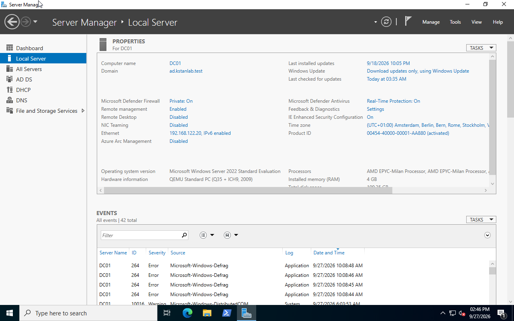
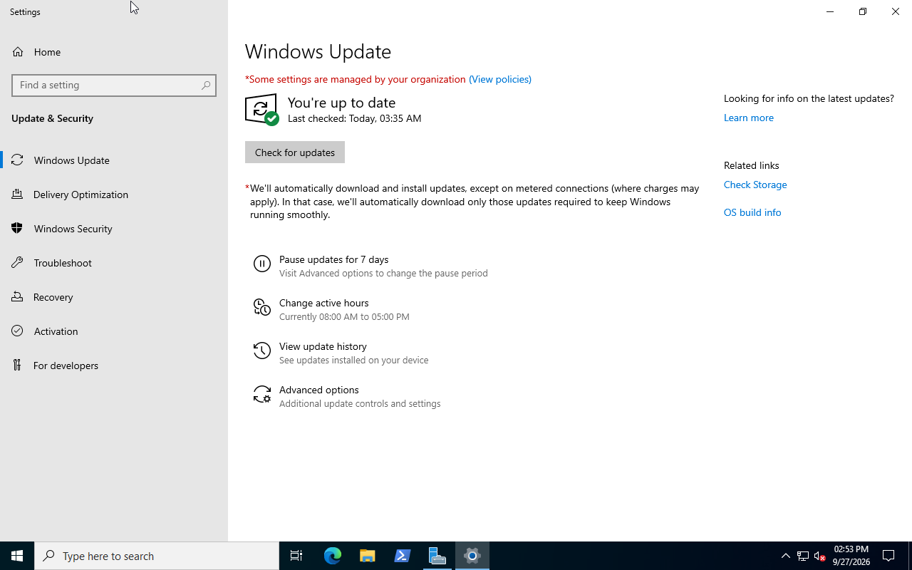
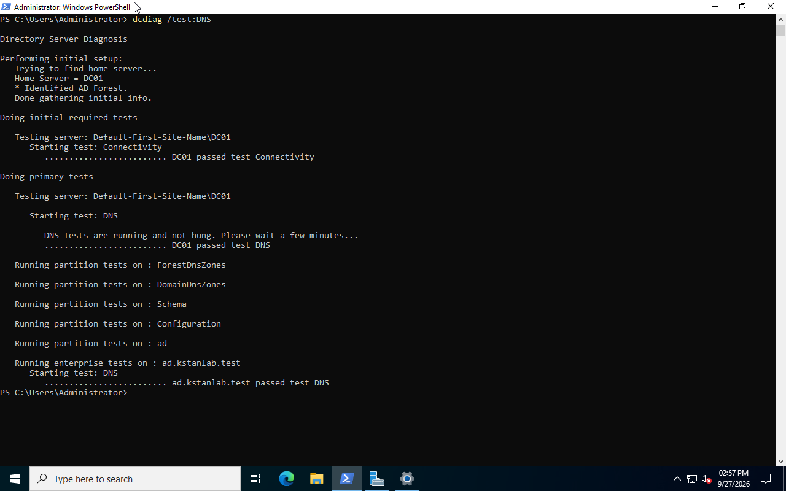
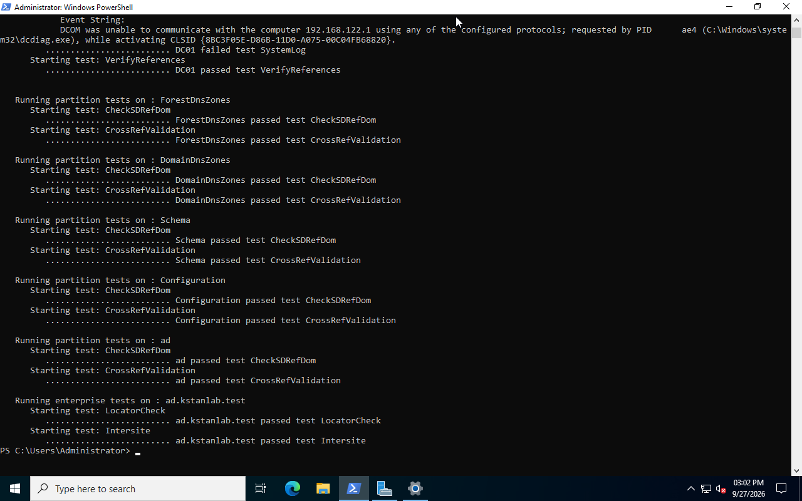

# Windows Server Maintenance and Health Check

This section demonstrates basic update management and health verification on the Windows Server 2022 domain controller `DC01`.

## Windows Update

The Windows Update status was checked before installing updates.

A Microsoft Defender Security Intelligence Update was available and installed.

After installation, Windows Update reported:

```text
You're up to date
```





## Service Verification

After the update, important Active Directory services were checked:

```powershell
Get-Service ADWS,DNS,DHCPServer,Netlogon
```

The following services were running:

- Active Directory Web Services
- DHCP Server
- DNS Server
- Netlogon

## DNS Health Check

DNS health was tested with:

```powershell
dcdiag /test:DNS
```

The domain controller passed the DNS tests.

```text
DC01 passed test DNS
ad.kstanlab.test passed test DNS
```



## Domain Controller Health Check

A broader Active Directory diagnostic was performed:

```powershell
dcdiag
```

The diagnostic completed successfully, with the displayed domain controller, directory partition, and enterprise tests reporting successful results.



## Result

The maintenance exercise demonstrated a basic server maintenance workflow:

1. Check the current update state.
2. Identify available updates.
3. Install the update.
4. Verify important Windows services.
5. Test DNS health.
6. Run domain controller diagnostics.

The server remained operational after the update, and the final diagnostic checks confirmed the health of the tested Active Directory and DNS components.
