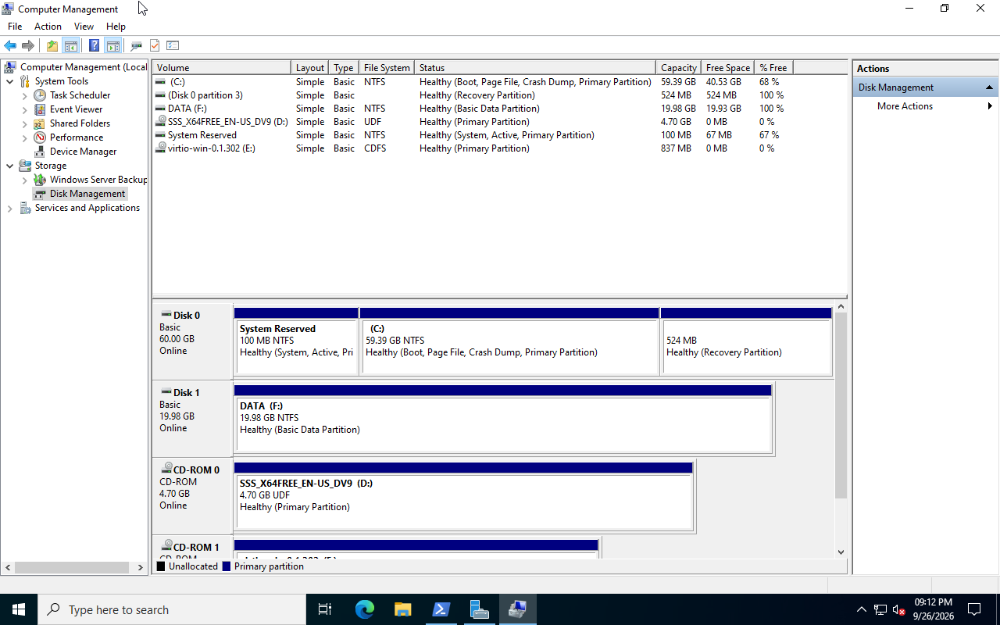
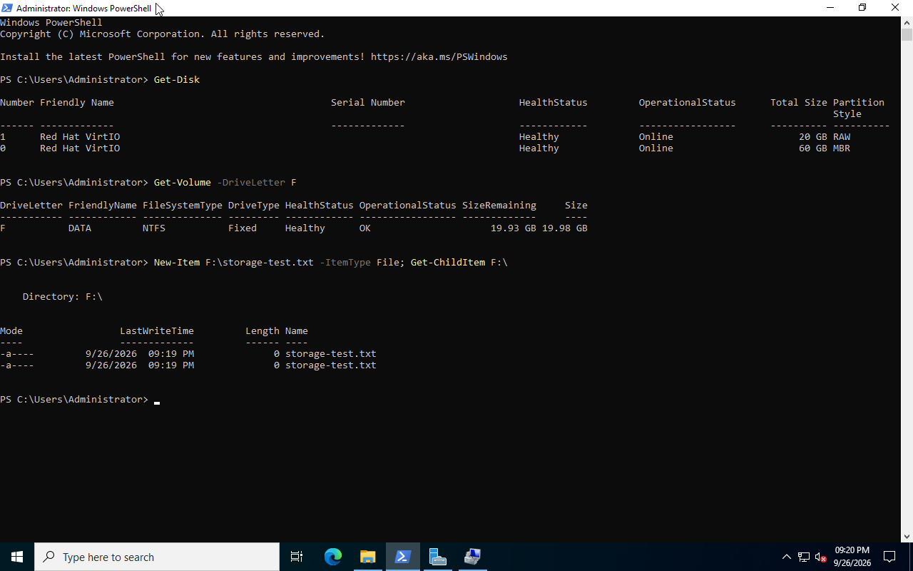

# Windows Server Storage Configuration

This section demonstrates basic storage administration on Windows Server 2022 running as a KVM/libvirt virtual machine.

## Objective

The objective was to add a separate virtual data disk to the domain controller `DC01`, configure it in Windows Server, and verify that the server can write data to the new volume.

## Environment

- Server: `DC01`
- Operating system: Windows Server 2022
- Hypervisor: KVM/QEMU with libvirt
- Virtual disk format: QCOW2
- Virtual disk size: 20 GB
- Windows volume: `DATA (F:)`
- File system: NTFS

## 1. Create the Virtual Disk

A 20 GB QCOW2 disk was created on the Linux virtualization host.

```bash
sudo qemu-img create -f qcow2 /var/lib/libvirt/images/dc01-data.qcow2 20G
```

The disk was verified before it was attached to the VM.

```bash
sudo qemu-img info /var/lib/libvirt/images/dc01-data.qcow2
```

The expected configuration was:

```text
file format: qcow2
virtual size: 20 GiB
corrupt: false
```

## 2. Attach the Disk to DC01

The disk was attached to `DC01` using the VirtIO bus.

```bash
sudo virsh -c qemu:///system attach-disk dc01 \
  /var/lib/libvirt/images/dc01-data.qcow2 \
  vdb \
  --targetbus virtio \
  --driver qemu \
  --subdriver qcow2 \
  --config
```

The libvirt configuration was verified and showed:

```xml
<disk type='file' device='disk'>
  <driver name='qemu' type='qcow2'/>
  <source file='/var/lib/libvirt/images/dc01-data.qcow2'/>
  <target dev='vdb' bus='virtio'/>
</disk>
```

## 3. Configure the Disk in Windows Server

Windows Server detected the new disk as a 20 GB disk.

The disk was configured with:

- Partition style: GPT
- Volume label: `DATA`
- Drive letter: `F:`
- File system: NTFS
- Volume size: approximately 20 GB

### Disk Management



## 4. Verify the Volume

PowerShell was used to verify the new volume.

```powershell
Get-Volume -DriveLetter F
```

The result confirmed that `DATA (F:)` was:

- NTFS
- Fixed storage
- Healthy
- Operational

A test file was then created to verify write access.

```powershell
New-Item F:\storage-test.txt -ItemType File; Get-ChildItem F:\
```

The test file was created successfully.

### PowerShell Verification




```text
DC01
├── C:  Windows Server system volume
└── F:  DATA
        └── NTFS, 20 GB
```

The disk is healthy and write access was successfully verified.
