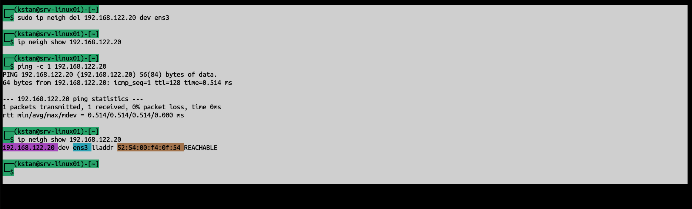
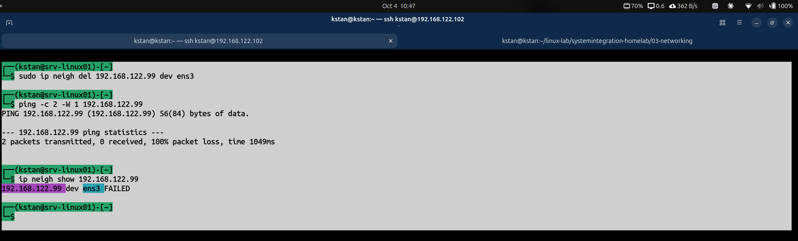

# ARP and Layer 2 Troubleshooting

## Objective

Understand how Linux maps IPv4 addresses to MAC addresses and troubleshoot local network reachability with the neighbor table.

## Check the Neighbor Table

```bash
ip neigh
```

`ip neigh` shows known neighboring devices and their IP-to-MAC mappings.

Important states:

- `REACHABLE` - the neighbor was recently confirmed as reachable.
- `STALE` - the MAC address is known, but reachability has not been confirmed recently.
- `FAILED` - neighbor resolution failed.

## Successful ARP Resolution

The cached entry for DC01 was removed:

```bash
sudo ip neigh del 192.168.122.20 dev ens3
```

After contacting DC01:

```bash
ping -c 1 192.168.122.20
```

Linux learned the MAC address again:

```text
192.168.122.20 dev ens3 lladdr 52:54:00:f4:0f:54 REACHABLE
```



## Failed Neighbor Resolution

An unused local IP address was tested:

```bash
ping -c 2 -W 1 192.168.122.99
```

The ping failed with 100% packet loss.

The neighbor table showed:

```text
192.168.122.99 dev ens3 FAILED
```

No device responded to the neighbor resolution attempt.



## Key Lesson

For devices on the same IPv4 subnet, the system needs the destination MAC address before it can send Ethernet frames directly to that device.

A useful troubleshooting sequence is:

```text
Check IP/subnet
      ↓
Check neighbor table
      ↓
Check MAC resolution
      ↓
Test IP connectivity
      ↓
Check higher-layer services
```

A `FAILED` neighbor entry can indicate a local network or Layer 2 reachability problem.
