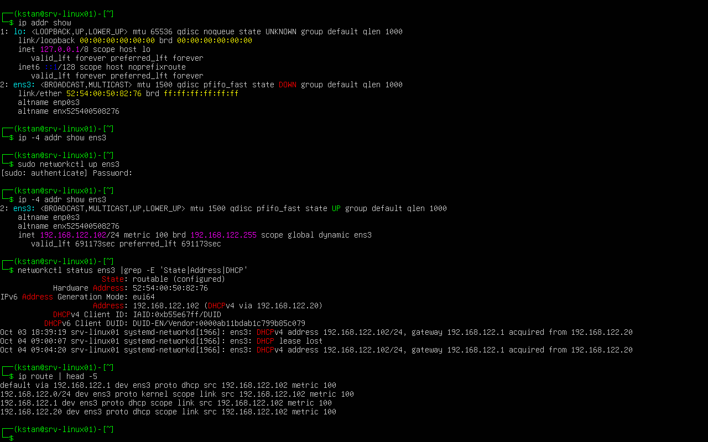

# DHCP Client Troubleshooting

## Objective

Troubleshoot loss of network configuration on a Linux DHCP client and restore connectivity.

## Baseline Configuration

`srv-linux01` received its network configuration from the Windows DHCP server:

```text
IP address:      192.168.122.102/24
Gateway:         192.168.122.1
DHCP server:     192.168.122.20
DNS server:      192.168.122.20
Interface:       ens3
```

The DHCP server was confirmed with:

```bash
networkctl status ens3
```

Result:

```text
Address: 192.168.122.102 (DHCPv4 via 192.168.122.20)
```

## Simulate Network Failure

The interface was brought down:

```bash
sudo networkctl down ens3
```

The interface lost its IPv4 configuration and remote SSH connectivity was interrupted.

## Restore Connectivity

Using the VM console, the interface was restored:

```bash
sudo networkctl up ens3
```

The DHCP client received its configuration again:

```text
192.168.122.102/24
Gateway: 192.168.122.1
DHCP server: 192.168.122.20
```

The default route was also restored:

```bash
ip route
```



## Key Lesson

A DHCP client requires more than an IP address.

Check:

```text
IP address
    ↓
Subnet
    ↓
Default gateway
    ↓
DNS server
    ↓
DHCP server
```

When remote administration is lost because the network interface is down, local VM console access can be used to restore the interface.
