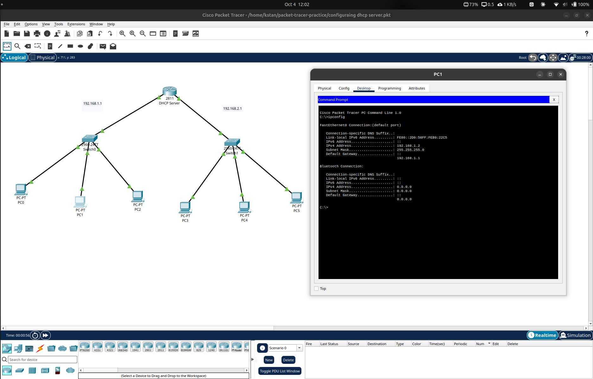
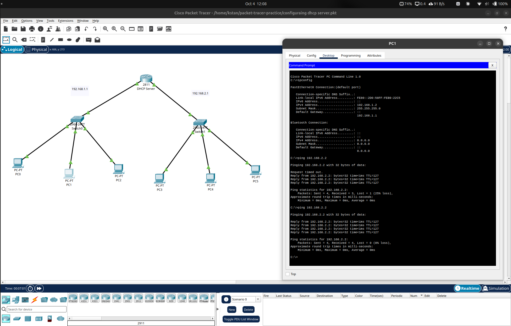

# Packet Tracer Multi-Network Lab

## Objective

Build two separate IPv4 LANs, provide automatic client addressing with DHCP, and route traffic between the networks.

## Topology

The Packet Tracer lab contains:

- One Cisco 2811 router
- Two Cisco 2960 switches
- Six client PCs
- Three PCs on each LAN



## Network Design

Two separate `/24` networks were configured.

| Network | Subnet | Router / Gateway |
|---|---|---|
| LAN 1 | `192.168.1.0/24` | `192.168.1.1` |
| LAN 2 | `192.168.2.0/24` | `192.168.2.1` |

Subnet mask:

```text
255.255.255.0
```

The router connects both IP networks.

## DHCP Configuration

The router provides DHCP addressing to the clients.

For example, PC1 received:

```text
IPv4 address:    192.168.1.2
Subnet mask:     255.255.255.0
Default gateway: 192.168.1.1
```

This confirms that the client received a valid configuration for LAN 1.

## Routing Between Networks

PC1 belongs to:

```text
192.168.1.0/24
```

The destination `192.168.2.2` belongs to:

```text
192.168.2.0/24
```

Because the destination is outside PC1's local subnet, PC1 sends the packet to its default gateway:

```text
192.168.1.1
```

The router then forwards the packet to LAN 2.

The communication path is:

```text
PC1
192.168.1.2
      ↓
192.168.1.1
Router
192.168.2.1
      ↓
192.168.2.2
Destination PC
```

## Connectivity Test

From PC1:

```text
ping 192.168.2.2
```

The first test contained an initial timeout followed by successful replies.

A second test returned:

```text
Packets: Sent = 4, Received = 4, Lost = 0 (0% loss)
```

This confirmed successful routing between the two LANs.



## Key Lessons

This lab demonstrates:

- IPv4 addressing
- `/24` subnetting
- DHCP client configuration
- Default gateways
- Switching inside a LAN
- Routing between different IP networks
- ICMP connectivity testing

Devices on the same subnet can communicate through their local Layer 2 network.

Devices on different IP subnets require a router or other Layer 3 device to forward traffic between the networks.
