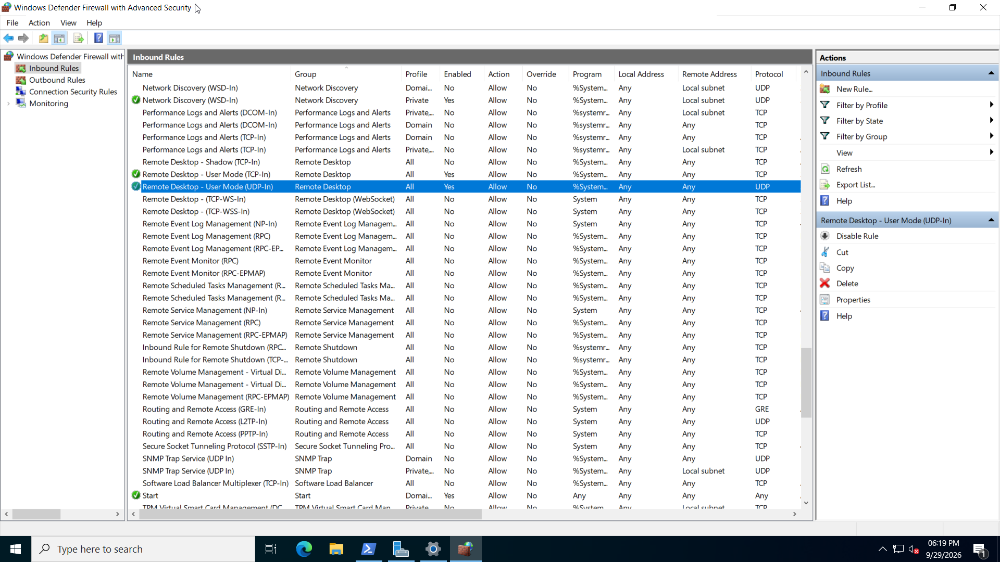
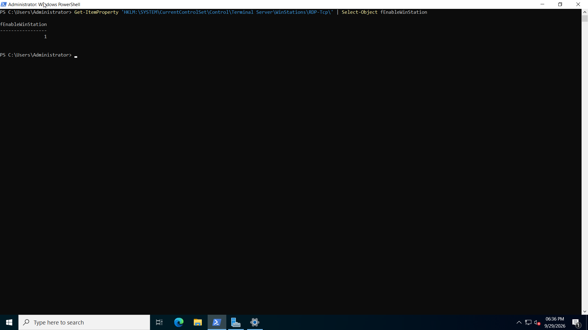

# RDP Connectivity Troubleshooting

This section demonstrates systematic network and service troubleshooting between an Ubuntu Server and a Windows Server 2022 domain controller.

## Environment

| System | Address | Role |
|---|---|---|
| `srv-linux01` | `192.168.122.102` | Ubuntu Server |
| `DC01` | `192.168.122.20` | Windows Server 2022 / Domain Controller |
| Gateway | `192.168.122.1` | Virtual network gateway |
| DNS | `192.168.122.20` | DNS Server on DC01 |

## 1. Verify Basic Connectivity

Connectivity from `srv-linux01` to the gateway, domain controller, and Internet was tested:

```bash
ping -c 4 192.168.122.1
ping -c 4 192.168.122.20
ping -c 4 8.8.8.8
```

All tests completed with `0% packet loss`.

This confirmed that basic IP connectivity and external routing were working.

## 2. Verify DNS

The Linux server received `DC01` as its DNS server:

```bash
resolvectl status
```

Result:

```text
Current DNS Server: 192.168.122.20
DNS Servers: 192.168.122.20
```

Internal DNS resolution was tested:

```bash
resolvectl query dc01.ad.kstanlab.test
```

Result:

```text
dc01.ad.kstanlab.test: 192.168.122.20
```

Forward and reverse DNS were also tested directly against DC01:

```bash
dig @192.168.122.20 dc01.ad.kstanlab.test
dig @192.168.122.20 -x 192.168.122.20
```

The forward lookup returned:

```text
dc01.ad.kstanlab.test. IN A 192.168.122.20
```

The reverse lookup returned:

```text
20.122.168.192.in-addr.arpa. IN PTR DC01.ad.kstanlab.test.
```

DNS was therefore working correctly.

## 3. Test Individual Services

TCP ports were tested from `srv-linux01` using Netcat:

```bash
nc -zv 192.168.122.20 53
nc -zv 192.168.122.20 445
nc -zvw 3 192.168.122.20 3389
```

Results:

```text
TCP 53   DNS   - reachable
TCP 445  SMB   - reachable
TCP 3389 RDP   - timed out
```

This demonstrated that successful `ping` does not prove that every service on a host is reachable.

## 4. Investigate RDP on DC01

Remote Desktop Services was checked:

```powershell
Get-Service TermService
```

`TermService` was running.

Remote Desktop was also enabled through:

```text
Server Manager
→ Local Server
→ Remote Desktop
→ Allow remote connections to this computer
```

The RDP configuration showed:

```text
fDenyTSConnections = 0
PortNumber = 3389
fEnableWinStation = 1
```

This confirmed that Remote Desktop was configured as enabled.

## 5. Check Windows Firewall

The Windows Defender Firewall inbound rules were inspected.

The following rules were enabled:

```text
Remote Desktop - User Mode (TCP-In)
Remote Desktop - User Mode (UDP-In)
```



The TCP 3389 test from Linux was repeated:

```bash
nc -zvw 3 192.168.122.20 3389
```

The connection still timed out.

This showed that the firewall rule was not the only problem.

## 6. Check the RDP Listener

The Windows RDP sessions and listeners were inspected:

```powershell
qwinsta.exe
```

No `rdp-tcp` listener appeared.

A direct check also returned:

```text
No session exists for rdp-tcp
```

The TCP listener was checked with:

```powershell
Get-NetTCPConnection -LocalPort 3389 -State Listen -ErrorAction SilentlyContinue
```

No listening connection was returned.


Both RDP-related services were also investigated.

```powershell
Get-Service TermService,UmRdpService
```

Even when both services were running, the expected TCP 3389 listener did not appear.



## Troubleshooting Result

The investigation established that:

- DC01 was reachable over the network.
- DNS resolution worked.
- TCP 53 was reachable.
- TCP 445 was reachable.
- Remote Desktop was enabled.
- RDP firewall rules were enabled.
- Remote Desktop services could run.
- TCP 3389 still timed out.
- No `rdp-tcp` listener was present.

The remaining issue was therefore isolated to the RDP listener or related server-side configuration.

The issue was intentionally left unresolved after the troubleshooting scope became deeper than required for this homelab exercise.

## Key Lesson

Troubleshooting should proceed layer by layer:

```text
IP configuration
      ↓
Network connectivity
      ↓
Name resolution
      ↓
Port connectivity
      ↓
Service status
      ↓
Application configuration
      ↓
Firewall
      ↓
Listener
```

A successful ping only proves basic IP reachability.

It does not prove that a specific application or TCP/UDP service is available.

The investigation also demonstrated the importance of verifying evidence before changing configuration.
