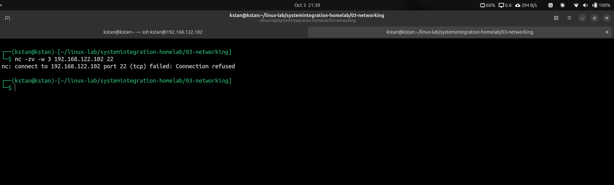

# TCP/UDP Ports and Service Connectivity

## Objective

Learn how to identify listening ports, test TCP connectivity, intentionally stop a service, diagnose the failure, and restore connectivity.

## Environment

- Linux server: `srv-linux01`
- IPv4 address: `192.168.122.102`
- Service tested: SSH
- Protocol: TCP
- Port: `22`

## Check Listening Ports

The following command displays listening TCP and UDP sockets:

```bash
sudo ss -tulpn
```

`ss` means socket statistics.

Options:

```text
-t = show TCP sockets
-u = show UDP sockets
-l = show listening sockets
-p = show the process using the socket
-n = show numerical addresses and port numbers
```

The output showed SSH listening on TCP port 22:

```text
0.0.0.0:22
[::]:22
```

`0.0.0.0:22` means SSH accepts connections on all IPv4 interfaces.

`[::]:22` means SSH accepts connections on IPv6 interfaces.

## Test the Port Remotely

From the physical host, TCP port 22 was tested with Netcat:

```bash
nc -zv 192.168.122.102 22
```

Netcat options:

```text
-z = test the port without sending application data
-v = show verbose output
-w = set a connection timeout
```

The connection succeeded:

```text
Connection to 192.168.122.102 22 port [tcp/ssh] succeeded!
```

## SSH Socket Activation

The SSH service was stopped:

```bash
sudo systemctl stop ssh
```

However, TCP port 22 continued listening.

The system reported:

```text
Stopping 'ssh.service', but its triggering units are still active:
ssh.socket
```

The listening socket was confirmed with:

```bash
sudo ss -tulpn | grep ':22'
```

This showed that `systemd` was still listening on port 22.

An incoming connection could therefore trigger `ssh.socket` and start `sshd` again.

## Introduce the Fault

Both the SSH service and socket were stopped:

```bash
sudo systemctl stop ssh.service ssh.socket
```

Port 22 was checked:

```bash
sudo ss -tulpn | grep ':22'
```

No listener was returned.

A remote port test was then performed:

```bash
nc -zv -w 3 192.168.122.102 22
```

Result:

```text
Connection refused
```



## Restore the Service

The SSH socket and service were started again:

```bash
sudo systemctl start ssh.socket ssh.service
```

Their status was verified:

```bash
systemctl is-active ssh.socket ssh.service
```

Result:

```text
active
active
```

Port 22 was listening again:

```bash
sudo ss -tulpn | grep ':22'
```

The remote connection test succeeded:

```bash
nc -zv -w 3 192.168.122.102 22
```

Result:

```text
Connection to 192.168.122.102 22 port [tcp/ssh] succeeded!
```


## Key Lessons

A reachable server does not automatically mean that a specific service is available.

Troubleshoot service connectivity in layers:

```text
Host reachable?
      ↓
Port listening locally?
      ↓
Service running?
      ↓
Port reachable remotely?
      ↓
Application working?
```

A `Connection refused` result normally indicates that the destination host was reached, but no service accepted the connection on that port.

Systemd socket activation can also keep a port available even when the associated service has been stopped.
